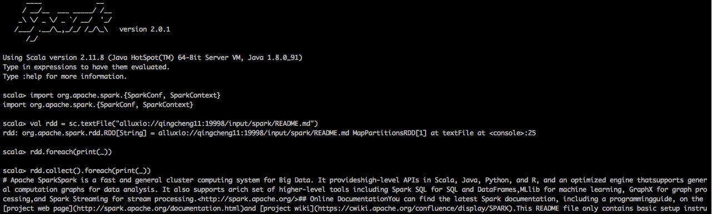
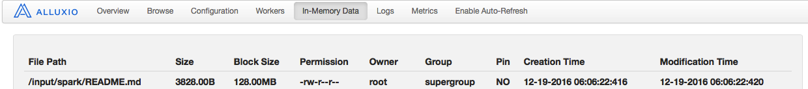
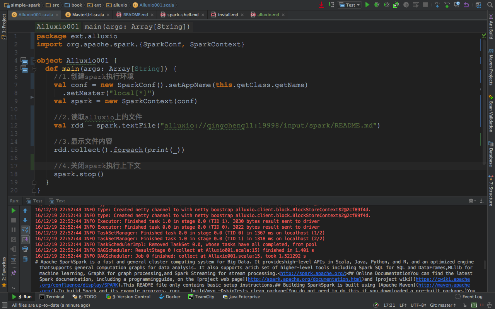
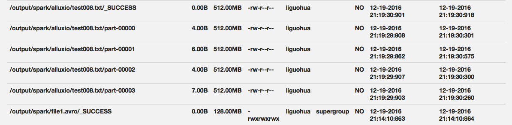

#一、spark与alluxio集成配置
##1.Alluxio提供的spark客户端软件包
```
1.下载地址
http://downloads.alluxio.org/downloads/files/1.3.0/alluxio-1.3.0-spark-client-jar-with-dependencies.jar

2.分发到各个机器上
scp $ALLUXIO_HOME/core/client/target/alluxio-1.3.0-spark-client-jar-with-dependencies.jar qingcheng12:$ALLUXIO_HOME/core/client/target
scp $ALLUXIO_HOME/core/client/target/alluxio-1.3.0-spark-client-jar-with-dependencies.jar qingcheng13:$ALLUXIO_HOME/core/client/target
```


##2.配置spark-defaults.conf
```
1.产生该文件
cp $SPARK_HOME/conf/spark-defaults.conf.template $SPARK_HOME/conf/spark-defaults.conf

2.编辑该文件
vim $SPARK_HOME/conf/spark-defaults.conf

3.添加内容
spark.executor.extraClassPath /bigdata/software/alluxio-1.3.0/core/client/target/alluxio-1.3.0-spark-client-jar-with-dependencies.jar
spark.driver.extraClassPath /bigdata/software/alluxio-1.3.0/core/client/target/alluxio-1.3.0-spark-client-jar-with-dependencies.jar

4.分发配置文件

scp $SPARK_HOME/conf/spark-defaults.conf qingcheng12:$SPARK_HOME/conf/
scp $SPARK_HOME/conf/spark-defaults.conf qingcheng13:$SPARK_HOME/conf/
```


##3.配置core-site.xml
```
1.编辑命令
vim $HADOOP_HOME/etc/hadoop/core-site.xml

2.添加内容
<property>
  <name>fs.alluxio.impl</name>
  <value>alluxio.hadoop.FileSystem</value>
  <description>The Alluxio FileSystem (Hadoop 1.x and 2.x)</description>
</property>
<property>
  <name>fs.alluxio-ft.impl</name>
  <value>alluxio.hadoop.FaultTolerantFileSystem</value>
  <description>The Alluxio FileSystem (Hadoop 1.x and 2.x) with fault tolerant support</description>
</property>
<property>
  <name>fs.AbstractFileSystem.alluxio.impl</name>
  <value>alluxio.hadoop.AlluxioFileSystem</value>
  <description>The Alluxio AbstractFileSystem (Hadoop 2.x)</description>
</property>

3.分发配置
scp $HADOOP_HOME/etc/hadoop/core-site.xml qingcheng12:$HADOOP_HOME/etc/hadoop/
scp $HADOOP_HOME/etc/hadoop/core-site.xml qingcheng13:$HADOOP_HOME/etc/hadoop/
```

##4.配置Hadoop集群
```
1.关闭Hadoop集群
${HADOOP_HOME}/sbin/hadoop-daemon.sh stop zkfc
${HADOOP_HOME}/sbin/stop-dfs.sh
${HADOOP_HOME}/sbin/hadoop-daemon.sh  stop  namenode

2.启动Hadoop集群
${HADOOP_HOME}/sbin/start-dfs.sh
${HADOOP_HOME}/sbin/hadoop-daemon.sh start zkfc
${HADOOP_HOME}/sbin/hadoop-daemon.sh  start  namenode
```
##4.重启spark集群
```
1.关闭spark集群
${SPARK_HOME}/sbin/stop-all.sh

2.启动spark集群
${SPARK_HOME}/sbin/start-all.sh
```


#二、spark与alluxio测试
##1.确保hdfs文件的访问权限
```
${HADOOP_HOME}/bin/hadoop dfs -chmod -R 755 /input
${HADOOP_HOME}/bin/hadoop dfs -chmod -R 755 /output
${ALLUXIO_HOME}/bin/alluxio fs chmod -R 755 /output
${ALLUXIO_HOME}/bin/alluxio fs ls -R /output
```
##2.打开spark-shell进行测试
```
1.启动spark-shell命令
$SPARK_HOME/bin/spark-shell --master spark://qingcheng11:7077

2.编写程序
import org.apache.spark.{SparkConf, SparkContext}
val rdd = sc.textFile("alluxio://qingcheng11:19998/input/spark/README.md")
rdd.collect().foreach(print(_))
```
##3.shell中的测试效果
 
##4.alluxio中的测试效果
 

#三、编程环境测试

##1.添加依赖jar包
```
 $ALLUXIO_HOME/core/client/target/alluxio-1.3.0-spark-client-jar-with-dependencies.jar
```
##2.编写读取程序
```
package ext.alluxio
import org.apache.spark.{SparkConf, SparkContext}

object Alluxio001 {
  def main(args: Array[String]) {
    //1.创建spark执行环境
    val conf = new SparkConf().setAppName(this.getClass.getName)
      .setMaster("local[*]")
    val spark = new SparkContext(conf)

    //2.读取alluxio上的文件
    val rdd = spark.textFile("alluxio://qingcheng11:19998/input/spark/README.md")

    //3.显示文件内容
    rdd.collect().foreach(print(_))

    //4.关闭spark执行上下文
    spark.stop()
  }
}
```
##3.读取运行效果
 

```
直接在alluxio中读取hdfs上的文件是可行的，如果alluxio中没有缓存改文件，那么alluxio会将hdfs文件读取出来
并缓存起来，以供下次直接使用。这是由于alluxio默认读取策略如下
alluxio.user.file.readtype.default	CACHE_PROMOTE

`CACHE_PROMOTE` (如果数据已经在Alluxio存储内，将其移动到最高存储层，如果数据需要从底层存储进行读取，
  将其写到本地Alluxio的最高存储层)、
`CACHE` (如果数据需要从底层存储进行读取，将其写到本地Alluxio的最高存储层),
`NO_CACHE` (数据不与Alluxio交互，如果是从Alluxio中进行读取，将不会发生数据块迁移或者剔除)。
```


        
##4.编写写入程序
```
package ext.alluxio

import org.apache.spark.{SparkConf, SparkContext}

object Alluxio002 {
  def main(args: Array[String]) {
//    System.setProperty("HADOOP_USER_NAME", "root")
    //1.创建spark执行环境
    val conf = new SparkConf().setAppName(this.getClass.getName)
      .setMaster("local[*]")
    val spark = new SparkContext(conf)

    //2.读取alluxio上的文件
    val rdd = spark.parallelize(1 to 10)
    rdd.saveAsTextFile("alluxio://qingcheng11:19998/output/spark/alluxio/test008.txt")
    //3.关闭spark执行上下文
    spark.stop()
  }
}
```
##3.写入运行效果
 
```
不会再hdfs上生成文件。这是因为我们在alluxio中的配置读取策略造成的默认情况是
alluxio.user.file.writetype.default	MUST_CACHE

`MUST_CACHE` (数据仅仅存储在Alluxio中，并且必须存储在其中), 
`CACHE_THROUGH` (尽量缓冲数据，同时同步写入到底层文件系统), 
`THROUGH` (不缓冲数据，同步写入到底层文件系统)。
```


