####一、spark软件包的下载与解压        
1.进入spark的官方网站：http://spark.apache.org
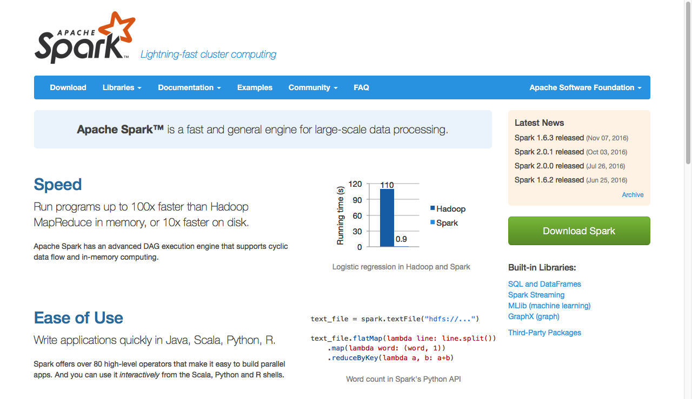 

2.点击download进入下载页：   
http://spark.apache.org/downloads.html   
选择好相应的版本进行，获取下载地址
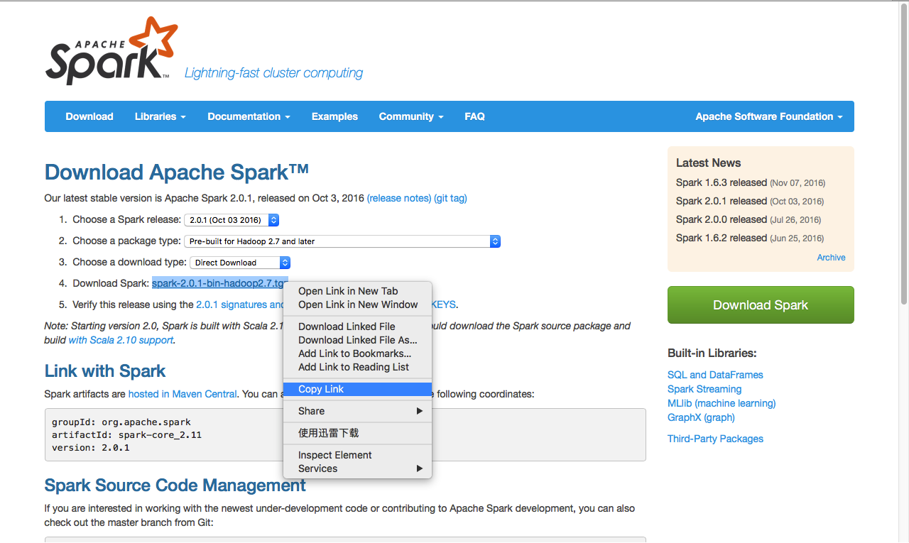 

4.用wget命令下载  
执行代码：
```
wget http://d3kbcqa49mib13.cloudfront.net/spark-2.0.1-bin-hadoop2.7.tgz
```
执行效果：
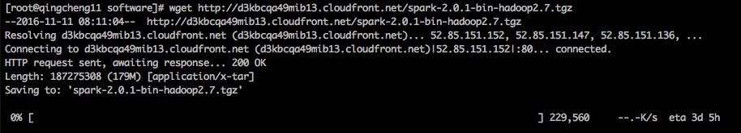 
下载完成后，将得到名称为spark-2.0.1-bin-hadoop2.7.tgz的软件压缩包

5.解析软件压缩包  
执行代码：
```
tar -zxvf spark-2.0.1-bin-hadoop2.7.tgz
```
解压将得到spark-2.0.1-bin-hadoop2.7文件夹

6.将spark安装文件发送到各个机器上  
执行代码：
```
scp -r /bigdata/software/spark-2.0.1-bin-hadoop2.7  qingcheng12:/bigdata/software/
scp -r /bigdata/software/spark-2.0.1-bin-hadoop2.7  qingcheng13:/bigdata/software/
```

7.配置SPARK_HOME环境变量

```
1.编辑环境变量文件
执行命令：
    vim ~/.bashrc
编辑内容：
    在环境办理文件中加入如下内容
    export SPARK_HOME=/bigdata/software/spark-2.0.1-bin-hadoop2.7
    export PATH=$SPARK_HOME/bin:$PATH
2.分发环境变量文件到其他机器
执行命令：
    scp ~/.bashrc  qingcheng12:~/.bashrc
    scp ~/.bashrc  qingcheng13:~/.bashrc
3.在每个机器上刷新环境变量
执行命令：
    source   ~/.bashrc
4.测试环境环境变量是否配置成功 
执行命令：
    $SPARK_HOME
执行效果：
    出现如下字样说明配置成功
    -bash: /bigdata/software/spark-2.0.1-bin-hadoop2.7: Is a directory
```

####二、spark在standalone模式主节点下无HA的部署实战
1.配置spark-evn.sh文件  
在spark中并没有提供spark-env.sh文件，只提供了spark-env.sh.template这个模板文件，
因此需要从模板文件复制创建spark-evn.sh文件，然后再编辑spark-evn.sh文件。   
1.1根据模板创建文件  
执行命令：
```
cp  ${SPARK_HOME}/conf/spark-env.sh.template ${SPARK_HOME}/conf/spark-env.sh
```

1.2编辑spark-evn.sh文件  
执行命令：
```
vim ${SPARK_HOME}/conf/spark-env.sh
```
添加内容：  
    此文件指定spark的运行环境。开头处加入以下内容。
```
#指定jdk安装目
export JAVA_HOME=/bigdata/software/jdk1.8.0_91
###指定scala安装目录
export SCALA_HOME=/bigdata/software/scala-2.11.7
#指定worker节点分配给Excutors的最大内存
export SPARK_WORKER_MEMORY=24G
#指定hadoop集群的配置文件目录
export HADOOP_CONF_DIR=/bigdata/software/hadoop-2.7.2
#指定spark集群的master节点的ip
export SPARK_MASTER_IP=qingcheng11
```

2.配置spark的slaves文件  
在spark中并没有提供slaves文件，只提供了slaves.template这个模板文件，
因此需要从模板文件复制创建slaves文件，然后再编辑sslaves文件。此文件用
于指定worker节点，一行一个work节点.   
2.1根据模板创建文件  
执行命令：
```
 cp  ${SPARK_HOME}/conf/slaves.template ${SPARK_HOME}/conf/slaves
```
2.2编辑slaves文件  
执行命令：
```
vim ${SPARK_HOME}/conf/slaves
```
添加内容：  
    在slaves文件中添加如下内容，表示集群的works.
```
qincheng11
qincheng12
qincheng13
```
3.分发spark配置文件  
执行命令：
```
scp -r ${SPARK_HOME}/conf/ qingcheng12:${SPARK_HOME}/
scp -r ${SPARK_HOME}/conf/ qingcheng13:${SPARK_HOME}/
```
执行效果：
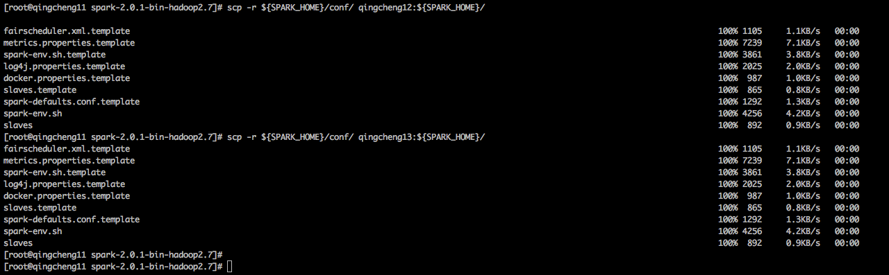 
4.启动spark服务  
    在主节点上启动spark服务  
执行命令：
```
${SPARK_HOME}/sbin/start-all.sh
```
执行效果：
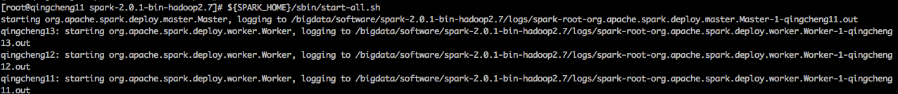 
5.验证spark服务   
5.1查看进程验证spark服务，在所有机器上执行，可以看到各自对应的进程名称。   
执行命令：
```
jps
```
执行效果：
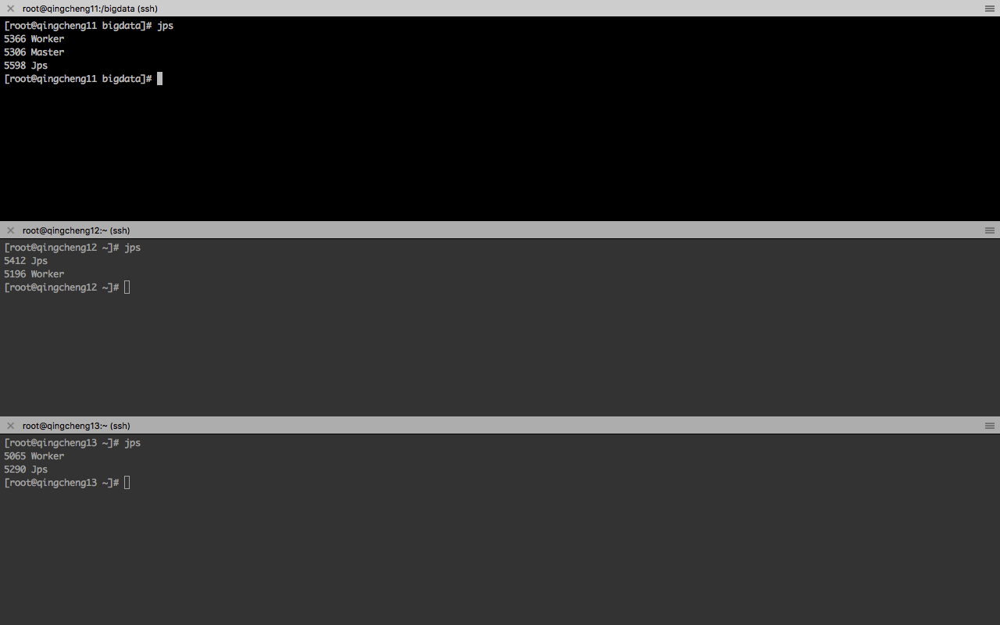 
5.2查看spark的web界面验证服务  
打开网址：  
    在浏览器中打开如下网址
```
http://qingcheng11:8080
```

执行效果：
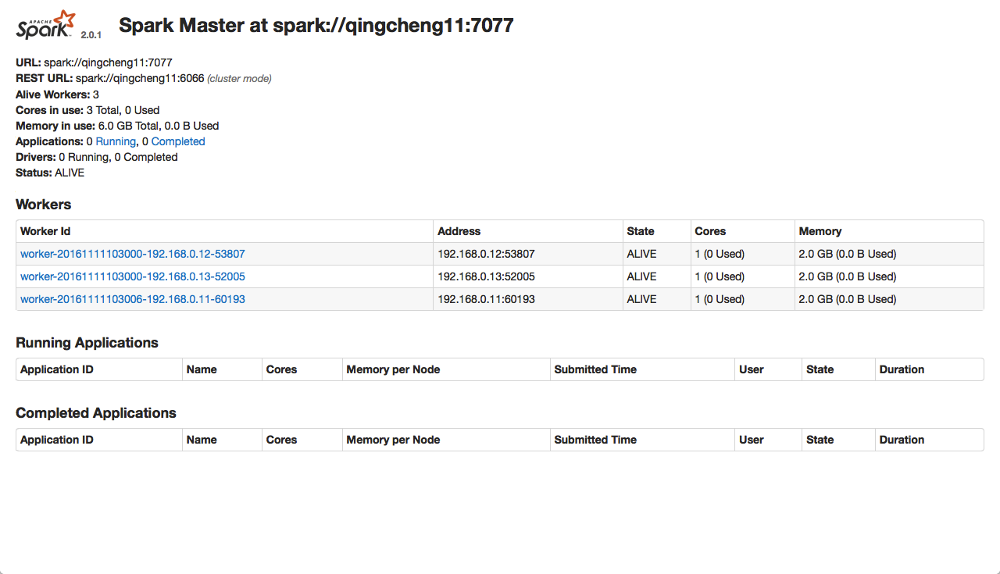 
可以看出spark的主节点和从节点的相应的进程都启动起来了，说明spark在standalone模式下主节点无HA的部署实战是成功的。

####三、spark在standalone模式下主节点有HA的部署实战

spark在standalone模式主节点下无HA的部署实战是成功的，那么有HA的部署实战就非常简单了。只需要修改一下spark-env.sh文件即可。   
1.停止spark服务  
执行命令:

```
${SPARK_HOME}/sbin/stop-all.sh
```
执行效果：
 

2.修改spark-env.sh文件  
执行命令：
```
vim ${SPARK_HOME}/conf/spark-env.sh
```
添加内容：  
```
1.设置SPARK_MASTER_IP
    将SPARK_MASTER_IP设置为空，也就是SPARK_MASTER_IP=
2.设置SPARK_DAEMON_JAVA_OPTS
    将SPARK_DAEMON_JAVA_OPTS执行zookeeper集群，并制定其在zookeeper中创建的znode路径，也就是设置为
    export SPARK_DAEMON_JAVA_OPTS="-Dspark.deploy.recoveryMode=ZOOKEEPER 
    -Dspark.deploy.zookeeper.url=qingcheng11:2181,qingcheng12:2181,qingcheng13:2181
    -Dspark.deploy.zookeeper.dir=/spark"
```
修改后的文件内容： 
```
#指定jdk安装目
export JAVA_HOME=/bigdata/software/jdk1.8.0_91
###指定scala安装目录
export SCALA_HOME=/bigdata/software/scala-2.11.7
#指定worker节点分配给Excutors的最大内存
export SPARK_WORKER_MEMORY=2G
#指定hadoop集群的配置文件目录
export HADOOP_CONF_DIR=/bigdata/software/hadoop-2.7.2
#指定spark集群的master节点的ip,HA模式下，不要填写任何地址
SPARK_MASTER_IP=
#指定hadoop集群的配置文件目录
export SPARK_DAEMON_JAVA_OPTS="-Dspark.deploy.recoveryMode=ZOOKEEPER 
-Dspark.deploy.zookeeper.url=qingcheng11:2181,qingcheng12:2181,qingcheng13:2181
-Dspark.deploy.zookeeper.dir=/spark"
```
3.分发spark-env.sh文件   
执行命令：
```
scp -r ${SPARK_HOME}/conf/spark-env.sh qingcheng12:${SPARK_HOME}/conf/
scp -r ${SPARK_HOME}/conf/spark-env.sh qingcheng13:${SPARK_HOME}/conf/
```
执行效果：
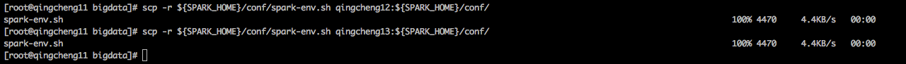 

4.启动zookeeper集群   
因为spark的主节点的HA依赖于zookeeper，因此必须首先开启zookeeper集群。   
4.1启动zookeeper服务   
执行命令：
```
${ZOOKEEPER_HOME}/bin/zkServer.sh start
```
执行效果：
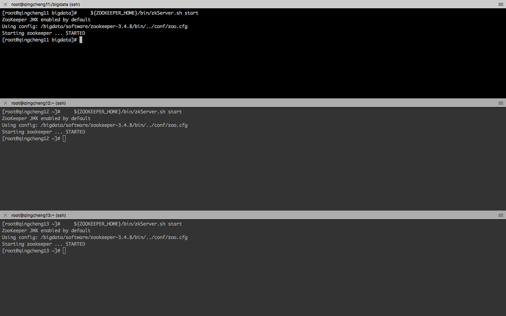 
4.2验证zookeeper服务
执行命令：
```
${ZOOKEEPER_HOME}/bin/zkServer.sh status
```
执行效果：
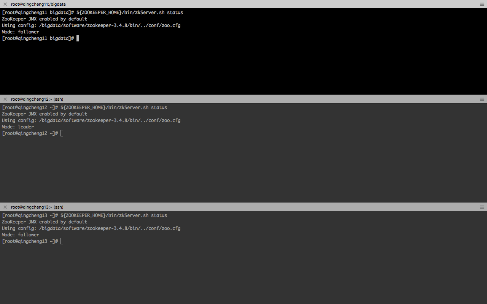 


5.启动spark集群   
在两个主节点上分别执行   
执行命令：
```
${SPARK_HOME}/sbin/start-all.sh
```
执行效果：
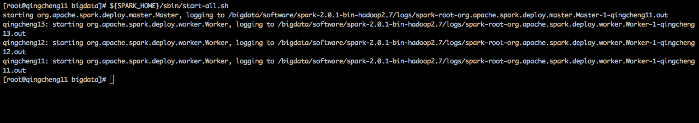 
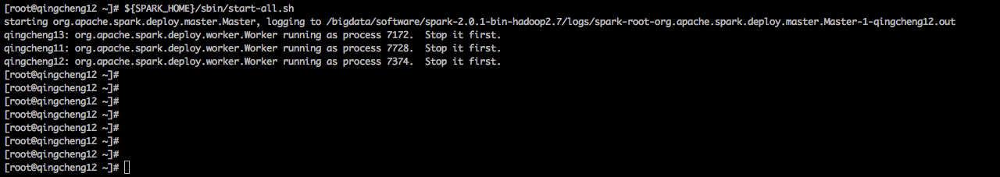 

6.验证spark服务   
6.1查看进程验证spark服务，在所有机器上执行，可以看到各自对应的进程名称。    
执行命令：
```
jps
```
执行效果：
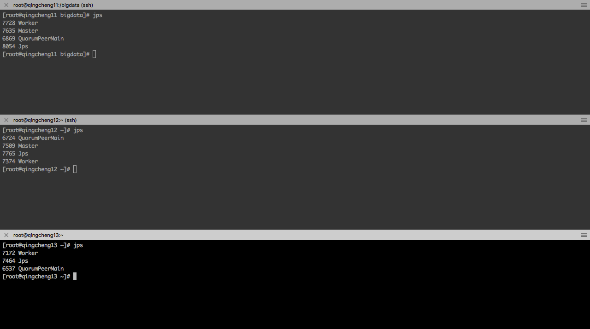 
6.2查看spark的web界面验证服务  
打开网址一：  
```
http://qingcheng11:8080
```
执行效果：
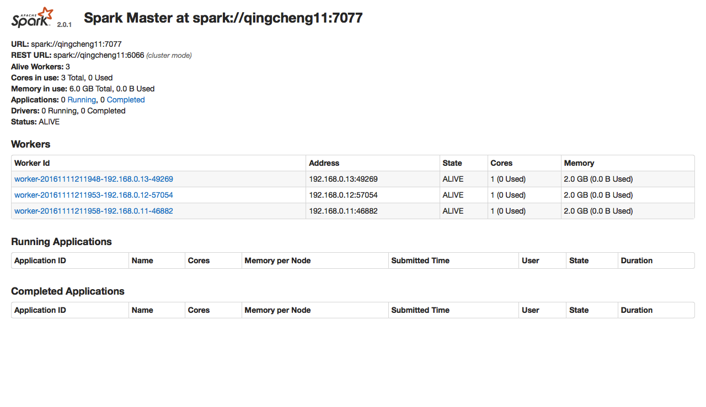 

打开网址二：  
```
http://qingcheng12:8080
```
执行效果：
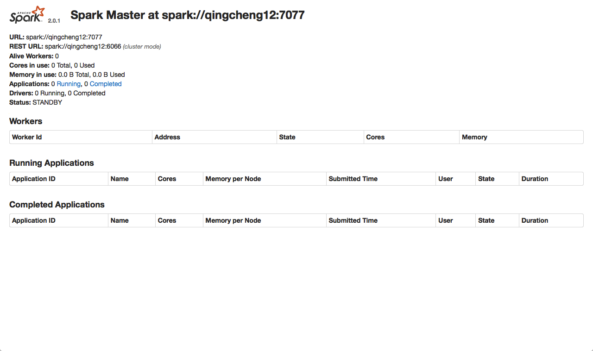 

可以看出spark的主节点和从节点的相应的进程都启动起来了，并且两个主节点都成功的启动了，
说明spark在standalone模式下主节点有HA的部署实战是成功的。


