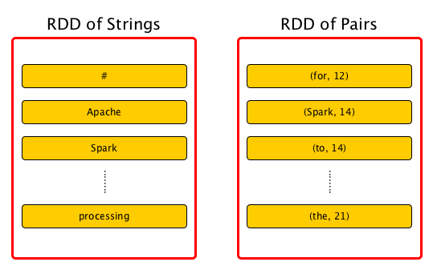
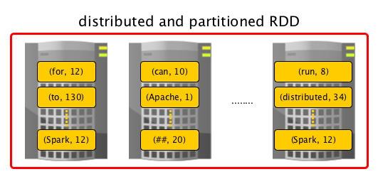

#一、spark简介
##1.官网地址
```
http://spark.apache.org
```
##2.Github地址
```
https://github.com/apache/spark
git://git.apache.org/spark.git
```
#二、spark特性
##1.处理速度快
 
```
1.spark是基于内存的分布式计算框架，它比基于磁盘的MapReduce快的多。
2.spark在job执行时会根据任务关系的DAG图进行计算优化。
```
##2.通用性好
 
```
1.spark的软件栈比较丰富，这些软件栈能够处理大量的业务场景。
2.spark支持批处理，流处理，sql,图计算，机器学习等。
```
##3.集成性好
 
```
1.spark和大数据生态圈中的其他技术集成性好，因此你可以把Spark和其他的大数据技术进行融合。
2.spark支持多种存储系统，多种调度系统，多种语言，因此spark的应用范围比较广泛。
```
#三、spark架构
##1.spark架构概览
 
```
1.spark和Hadoop一样是一个主从式分布式的通用内存计算框架。
2.主节点充当ClusterManager的角色，负责分发任务，并监控从节点上的任务执行情况。
  2.1在standalone模式下，ClusterManager就spark的master节点。
  2.2在sparkOnYarn模式下，ClusterManager就是yarn的resourceManager
  2.3在sparkOnMesos模式下，ClusterManager就是mesosMaster。
3.从节点充当worker的角色，负责执行任务，并报任务进度给主节点。
  3.1worker中有一个或多executor进程，每个executor有一个cache用于缓存数据。
  3.2每个executor有一个或多个Task线程，复制具体执行分布式任务。
4.Driver在spark中是用来启动具体的application，它一般包含一个sparkContext用于
  表示spark执行上下文，通过sparkContext可以做一些设置操作。
```
 
```
spark2.0中提出了sparkSession的概念，可以认为是对spark1.x中的sparkContex的封装。
通过sparkSession，我们可以使用sparkSQL的内容。
```
 
##2.spark程序执行过程
 
```
1.我们编写的spark程序先提交到spark的master节点，然后由master节点分发到各个worker节点
2.worker节点实时的上报只能选进度给maser节点，并将最终的结果返回给用户。
```
##3.spark中的概念
|概念    |含义|
|---|---|
|Application|User program built on Spark. Consists of a driver program and executors on the cluster.|
|Application jar|A jar containing the user's Spark application. In some cases users will want to create an "uber jar" containing their application along with its dependencies. The user's jar should never include Hadoop or Spark libraries, however, these will be added at runtime.|
|Driver program|The process running the main() function of the application and creating the SparkContext|
|Cluster manager|An external service for acquiring resources on the cluster (e.g. standalone manager, Mesos, YARN)|
|Worker node|Any node that can run application code in the cluster|
|Executor|A process launched for an application on a worker node, that runs tasks and keeps data in memory or disk storage across them. Each application has its own executors.|
|Job|A parallel computation consisting of multiple tasks that gets spawned in response to a Spark action (e.g. save, collect); you'll see this term used in the driver's logs.|
|Stage|Each job gets divided into smaller sets of tasks called stages that depend on each other (similar to the map and reduce stages in MapReduce); you'll see this term used in the driver's logs.|
#四、RDD概念
##1.RDD概念介绍
 
```
1.spark的核心概念就是RDD(Resilient Distributed Dataset:弹性分布式数据集)
2.Resilient(弹性)：RDD具有容错功能，如果RDD部分或全部的partition损坏了，它能根据RDD的lineage关系重新计算这些分区。
3.Distributed(分布式)：数据被分散到集群的多个节点上。
4.Dataset(数据集):RDD就是一个分布式的数据集合的概念。
5.你可以把它想象成一个分布式的collection，这个collection是被切分成很多partition，
  这些partition有分散到各个节点上。因此它能够在多个节点上并行的处理不同的partition。
```
 
##2.RDD特性
|特性|含义|
|---|---|
|In-Memory|rdd主要是以内存为中心的，stored in memory as much (size) and long (time) as possible.|
|Immutable(Read-Only)|rdd是只读的，不会改变内容的。如果对rdd执行transform，将产生新的rdd|
|Lazy evaluated|rdd是懒计算的，所有对rdd的transform操作都是标记性的，不立即计算。等有action的时候，一起触发计算。|
|Cacheable|rdd是能够被缓存的，可以将rdd缓存到内存或磁盘，以备下次直接使用。|
|Partitioned|rdd是有分区的，这些分区分散到集群的各个node上|
|Parallel|rdd能够被并行处理的，因为它的分区被分散到各个node上，每一个分区都可以单独进行计算|
|Typed|rdd中的数据是有类型的，这和集合类似。 比如有的类型为RDD[Long]，有的类型为RDD[(Int, String)].|