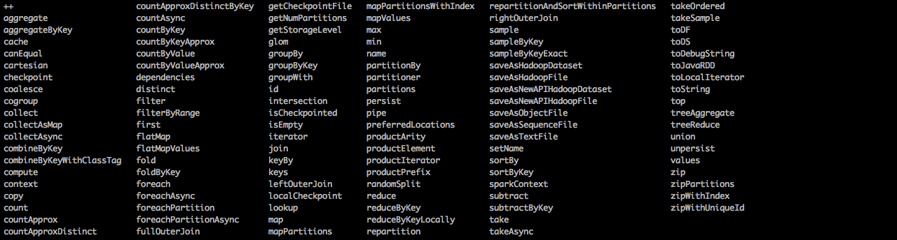

#spark2.0键值对类型RDD上的算子详解
spark2.0在单值类型的RDD层面上为我们提供了118个算子。我们和讲解单值类型rdd哪有讲解键值对类型的rdd算子。
 


---
##++(otherDataset)
```
def ++(other: RDD[T]): RDD[T]
```
将两个rdd合并到一起并产生一个新的rdd，新rdd的分区是原来两个rdd的分区之和。  
并且保留原rdd之间的顺序，已经原rdd中元素的顺序。不会精简重复元素。  
执行代码：
```
val a = sc.parallelize(List( ("cat",2), ("cat", 5), ("mouse", 4)), 4)
val b = sc.parallelize(List( ("jack",2), ("tom", 5), ("brown", 4)), 5)

val c=(a ++ b)
c.collect
c.partitions.size

val d=(b ++ a)
d.collect
c.partitions.size
```
代码详解：
```
//1.创建两个RDD，一个4分区，一个5分区
scala> val a = sc.parallelize(List( ("cat",2), ("cat", 5), ("mouse", 4)), 4)
a: org.apache.spark.rdd.RDD[(String, Int)] = ParallelCollectionRDD[39] at parallelize at <console>:24

scala> val b = sc.parallelize(List( ("jack",2), ("tom", 5), ("brown", 4)), 5)
b: org.apache.spark.rdd.RDD[(String, Int)] = ParallelCollectionRDD[40] at parallelize at <console>:24

//2.c=(a ++ b),c的分区数以为a,b两个rdd分区数之和
scala> val c=(a ++ b)
c: org.apache.spark.rdd.RDD[(String, Int)] = UnionRDD[41] at $plus$plus at <console>:28

scala> c.collect
res49: Array[(String, Int)] = Array((cat,2), (cat,5), (mouse,4), (jack,2), (tom,5), (brown,4))

scala> c.partitions.size
res50: Int = 9

//3.d=(b ++ a),d的分区数以为a,b两个rdd分区数之和
scala> val d=(b ++ a)
d: org.apache.spark.rdd.RDD[(String, Int)] = UnionRDD[42] at $plus$plus at <console>:28

scala> d.collect
res51: Array[(String, Int)] = Array((jack,2), (tom,5), (brown,4), (cat,2), (cat,5), (mouse,4))

scala> c.partitions.size
res52: Int = 9
```
spark web UI运行效果之job信息：
 

---
##aggregate()?