#spark2.0单值类型RDD上的算子详解

spark2.0在单值类型的RDD层面上为我们提供了84个算子，应付日常的数据处理已经基本够用了，通过组合这些算子，我们能写出非常棒的数据处理程序。
本教程按照下图的顺序，也就是字母顺序依次讲解这些算子。有些算子过于底层，也不常用，那就没有必要死扣这些算子。
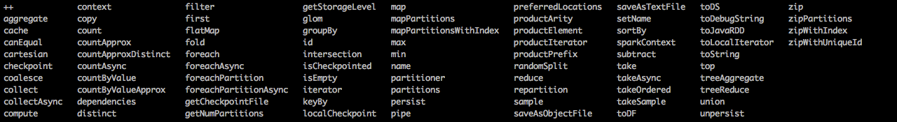 

---
##++
```
def ++(other: RDD[T]): RDD[T]
```

将两个rdd合并到一起并产生一个新的rdd，新rdd的分区是原来两个rdd的分区之和。  
并且保留原rdd之间的顺序，已经原rdd中元素的顺序。不会精简重复元素。  
执行代码：
```
val a = sc.parallelize(1 to 3, 4)
val b = sc.parallelize(6 to 9, 5)

val c=(a ++ b)
c.collect
c.partitions.size

val d=(b ++ a)
d.collect
c.partitions.size

```
代码详解：
```
//1.创建两个RDD，一个4分区，一个5分区
scala> val a = sc.parallelize(1 to 3, 4)
a: org.apache.spark.rdd.RDD[Int] = ParallelCollectionRDD[29] at parallelize at <console>:24

scala> val b = sc.parallelize(6 to 9, 5)
b: org.apache.spark.rdd.RDD[Int] = ParallelCollectionRDD[30] at parallelize at <console>:24


//2.c=(a ++ b),c的分区数以为a,b两个rdd分区数之和
scala> val c=(a ++ b)
c: org.apache.spark.rdd.RDD[Int] = UnionRDD[31] at $plus$plus at <console>:28

//2.1显示结果
scala> c.collect
res25: Array[Int] = Array(1, 2, 3, 6, 7, 8, 9)

//2.2显示分区
scala> c.partitions.size
res26: Int = 9

//3.d=(b ++ a),d的分区数以为a,b两个rdd分区数之和
scala> val d=(b ++ a)
d: org.apache.spark.rdd.RDD[Int] = UnionRDD[32] at $plus$plus at <console>:28

scala> d.collect
res27: Array[Int] = Array(6, 7, 8, 9, 1, 2, 3)

scala> c.partitions.size
res28: Int = 9
```
spark web UI运行效果之job信息：
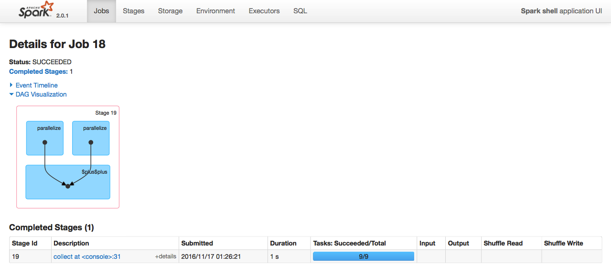 

---
##aggregate
```
def aggregate[U](zeroValue: U)(seqOp: (U, T) ⇒ U, combOp: (U, U) ⇒ U)(implicit arg0: ClassTag[U]): U
```
aggregate用户聚合RDD中的元素，先使用seqOp将RDD中每个分区中的T类型元素聚合成U类型，再使用combOp将之前每个分区聚合  
后的U类型聚合成U类型，特别注意seqOp和combOp都会使用zeroValue的值，zeroValue的类型为U。  
运行代码：
``` 

var rdd1 = sc.makeRDD(1 to 10,2)
val a = rdd1.aggregate(1)(
	{(x : Int,y : Int) => x + y}, 
	{(a : Int,b : Int) => a + b}
)

val b = rdd1.aggregate(1)(
	{(x : Int,y : Int) => x + y}, 
	{(a : Int,b : Int) => a * b}
)

rdd1.mapPartitionsWithIndex{(partIdx,iter) => {
	  var part_map = scala.collection.mutable.Map[String,List[Int]]()
	    while(iter.hasNext){
	      var part_name = "part_" + partIdx;
	      var elem = iter.next()
	      if(part_map.contains(part_name)) {
	        var elems = part_map(part_name)
	        elems ::= elem
	        part_map(part_name) = elems
	      } else {
	        part_map(part_name) = List[Int]{elem}
	      }
	    }
	    part_map.iterator
	}
}.collect
```
代码详解：
```
//1.创建2分区的rdd
scala> var rdd1 = sc.makeRDD(1 to 10,2)
rdd1: org.apache.spark.rdd.RDD[Int] = ParallelCollectionRDD[220] at makeRDD at <console>:24

//2.执行aggregate
scala> val a = rdd1.aggregate(1)(
     |     {(x : Int,y : Int) => x + y},
     |     {(a : Int,b : Int) => a + b}
     | )
a: Int = 58

//3.执行aggregate
scala> val b = rdd1.aggregate(1)(
     |     {(x : Int,y : Int) => x + y},
     |     {(a : Int,b : Int) => a * b}
     | )
b: Int = 656

scala>

//4.查看分区内的元素
scala> rdd1.mapPartitionsWithIndex{(partIdx,iter) => {
     |       var part_map = scala.collection.mutable.Map[String,List[Int]]()
     |         while(iter.hasNext){
     |           var part_name = "part_" + partIdx;
     |           var elem = iter.next()
     |           if(part_map.contains(part_name)) {
     |             var elems = part_map(part_name)
     |             elems ::= elem
     |             part_map(part_name) = elems
     |           } else {
     |             part_map(part_name) = List[Int]{elem}
     |           }
     |         }
     |         part_map.iterator
     |     }
     | }.collect
res202:Array[(String,List[Int])] = Array((part_0,List(5, 4, 3, 2, 1)),(part_1,List(10, 9, 8, 7, 6)))


//5.第一个结果的推理过程
//5.1分区内的元素
第一个分区中包含5,4,3,2,1
第二个分区中包含10,9,8,7,6

//5.2各个分区内元素要执行的函数
先在每个分区中迭代执行 (x : Int,y : Int) => x + y 并且使用zeroValue的值1
part_0中 zeroValue+5+4+3+2+1 = 1+5+4+3+2+1 = 16
part_1中 zeroValue+10+9+8+7+6 = 1+10+9+8+7+6 = 41

//5.3分区结果间要执行的函数
再将两个分区的结果合并(a : Int,b : Int) => a + b ，并且使用zeroValue的值1
zeroValue+part_0+part_1 = 1 + 16 + 41 = 58

//6.第二个结果的推理过程
//6.1分区内的元素
第一个分区中包含5,4,3,2,1
第二个分区中包含10,9,8,7,6

//6.2各个分区内元素要执行的函数
先在每个分区中迭代执行 (x : Int,y : Int) => x + y 并且使用zeroValue的值1
part_0中 zeroValue+5+4+3+2+1 = 1+5+4+3+2+1 = 16
part_1中 zeroValue+10+9+8+7+6 = 1+10+9+8+7+6 = 41

//6.3分区结果间要执行的函数
再将两个分区的结果合并(a : Int,b : Int) => a * b ，并且使用zeroValue的值1
zeroValue*part_0*part_1 = 1 * 16 * 41 = 656
```
spark web UI运行效果之job信息：
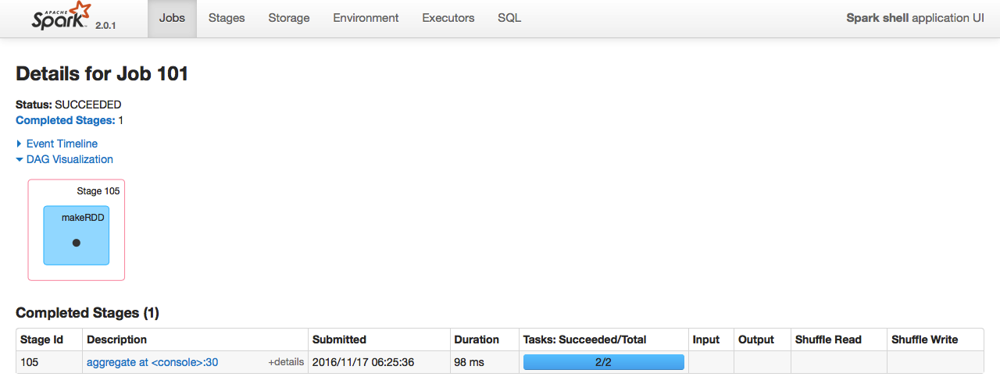 


---
##cache
将rdd缓存到分布式内存中，以加快rdd的访问效率。  
运行代码：
``` 
val a = sc.parallelize(1 to 3, 4)
a.count

a.cache()
a.count
```
代码详解：
```
//1.创建4分区的rdd
scala> val a = sc.parallelize(1 to 3, 4)
a: org.apache.spark.rdd.RDD[Int] = ParallelCollectionRDD[46] at parallelize at <console>:24

scala> a.count
res61: Long = 3

//2.缓存rdd,以加快rdd的访问效率。
scala> a.cache()
res62: a.type = ParallelCollectionRDD[46] at parallelize at <console>:24

scala> a.count
res63: Long = 3
```
spark web UI运行效果之job信息：  
缓存前：  
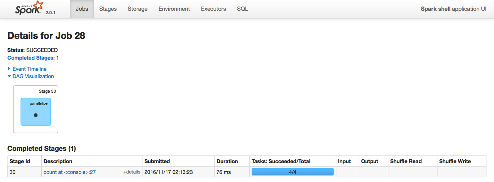 
缓存后：  
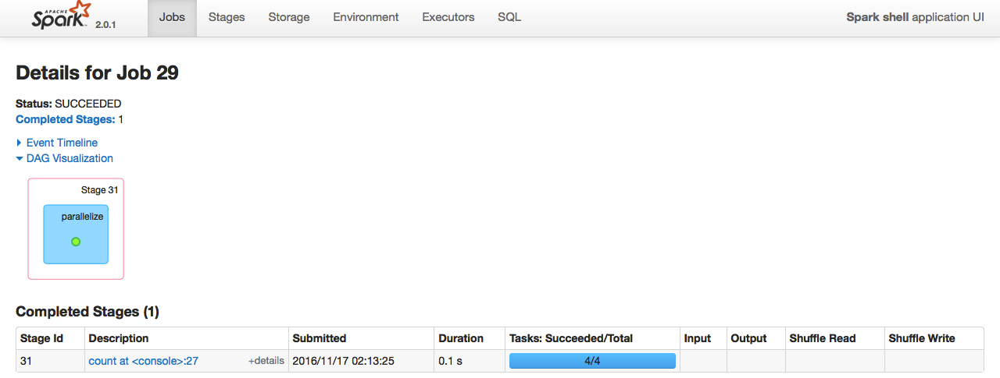 
缓存前用时76ms，缓存后用时0.1s，可见速度提高不少。     
spark web UI运行效果之Storage信息：  
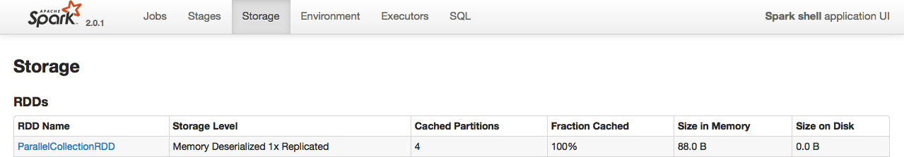 

---
##canEqual?


---
##cartesian
```
def cartesian[U: ClassTag](other: RDD[U]): RDD[(T, U)]
```
将两个rdd的笛卡尔积，分区数为两个rdd的分区数之积。  
运行代码：
``` 
val x = sc.parallelize(List(1,2,3),4)
val y = sc.parallelize(List(7,8,9),5)

val a = x.cartesian(y)
a.collect
a.partitions.size

val b = y.cartesian(x)
b.collect
b.partitions.size
```
代码详解：
```
//1.创建两个RDD，一个4分区，一个5分区
scala> val x = sc.parallelize(List(1,2,3),4)
x: org.apache.spark.rdd.RDD[Int] = ParallelCollectionRDD[52] at parallelize at <console>:24

scala> val y = sc.parallelize(List(7,8,9),5)
y: org.apache.spark.rdd.RDD[Int] = ParallelCollectionRDD[53] at parallelize at <console>:24

//2.两个RDD进行笛卡尔积
scala> val a = x.cartesian(y)
a: org.apache.spark.rdd.RDD[(Int, Int)] = CartesianRDD[54] at cartesian at <console>:28

scala> a.collect
res74: Array[(Int, Int)] = Array((1,7), (1,8), (1,9), (2,7), (2,8), (2,9), (3,7), (3,8), (3,9))

scala> a.partitions.size
res75: Int = 20

//3.两个RDD进行笛卡尔积
scala> val b = y.cartesian(x)
b: org.apache.spark.rdd.RDD[(Int, Int)] = CartesianRDD[55] at cartesian at <console>:28

scala> b.collect
res76: Array[(Int, Int)] = Array((7,1), (7,2), (7,3), (8,1), (8,2), (8,3), (9,1), (9,2), (9,3))

scala> b.partitions.size
res77: Int = 20
```
spark web UI运行效果之job信息：
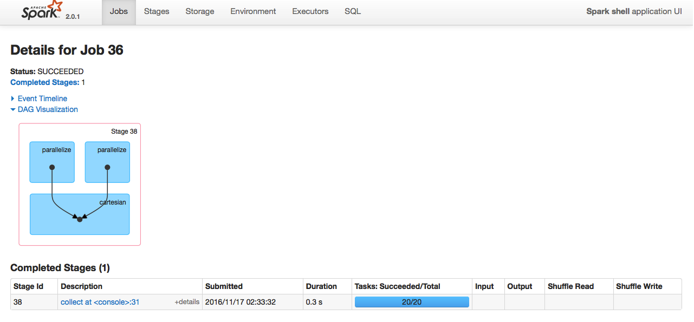 


---
##checkpoint
```
def checkpoint()
```
将两个rdd的笛卡尔积，分区数为两个rdd的分区数之积。  
运行代码：
``` 
sc.setCheckpointDir("/bigdata/software/spark-checkpoiont")
val a = sc.parallelize(List("zhangsan","lisi"))
a.count

a.checkpoint
a.count
a.toDebugString

val b=a.dependencies(0).rdd
b.collect
b.toDebugString
```
代码详解：
```
//1.设置checkpoint路径，如果spark不是本地运行方式，应当设置为hdfs的路径
scala> sc.setCheckpointDir("hdfs://qingcheng11:9000/input/spark/checkpoint")

//2.初始化rdd
scala> val a = sc.parallelize(List("zhangsan","lisi"))
a: org.apache.spark.rdd.RDD[String] = ParallelCollectionRDD[72] at parallelize at <console>:24

//3.将rddcheckpoint到hdfs上，这样数据就算是持久化了，即便是运算失败了，只要读取checkpoint的信息即可。
scala> a.checkpoint

//4.统计rdd的信息
scala> a.count
res119: Long = 2

//5.查看依赖信息，能看到ReliableCheckpointRDD的信息
scala> a.toDebugString
res5: String =
(3) ParallelCollectionRDD[0] at parallelize at <console>:24 []
 |  ReliableCheckpointRDD[1] at count at <console>:27 []
 
//6.使用checkpoint数据创建rdd 
scala> val b=a.dependencies(0).rdd
b: org.apache.spark.rdd.RDD[_] = ReliableCheckpointRDD[1] at count at <console>:27

scala> b.collect
res14: Array[_] = Array(zhangsan, lisi)
 
scala> b.toDebugString
res15: String = (3) ReliableCheckpointRDD[3] at count at <console>:27 []
```
hadoop hdfs UI运行效果：
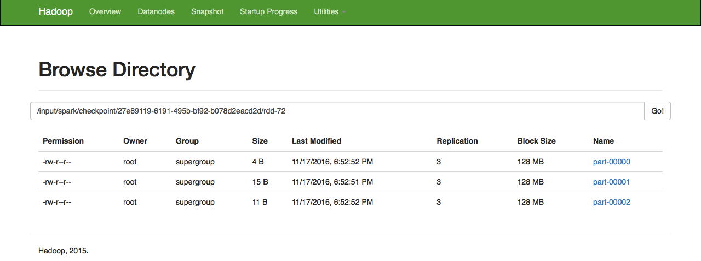 
spark web UI运行效果之job信息：
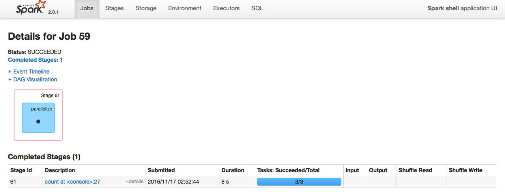 

---
##coalesce 
```
def coalesce ( numPartitions : Int , shuffle : Boolean = false ): RDD [T]
```
对rdd进行重分区  
运行代码：
``` 
val a = sc.parallelize(1 to 10, 10)
a.partitions.length

val b = a.coalesce(2, false)
b.count
b.partitions.length

val c = a.coalesce(2, true)
c.count
c.partitions.length
```
代码详解：
```
//1.创建10分区的RDD
scala> val a = sc.parallelize(1 to 10, 10)
a: org.apache.spark.rdd.RDD[Int] = ParallelCollectionRDD[34] at parallelize at <console>:24

scala> a.partitions.length
res76: Int = 10

//2.无shuffle生成2分区的RDD
scala> val b = a.coalesce(2, false)
b: org.apache.spark.rdd.RDD[Int] = CoalescedRDD[35] at coalesce at <console>:26

scala> b.count
res77: Long = 10

scala> b.partitions.length
res78: Int = 2

//3.有shuffle生成2分区的RDD
scala> val c = a.coalesce(2, true)
c: org.apache.spark.rdd.RDD[Int] = MapPartitionsRDD[39] at coalesce at <console>:26

scala> c.count
res79: Long = 10

scala> c.partitions.length
res80: Int = 2
```
spark web UI运行效果之job信息（无shuffle）：
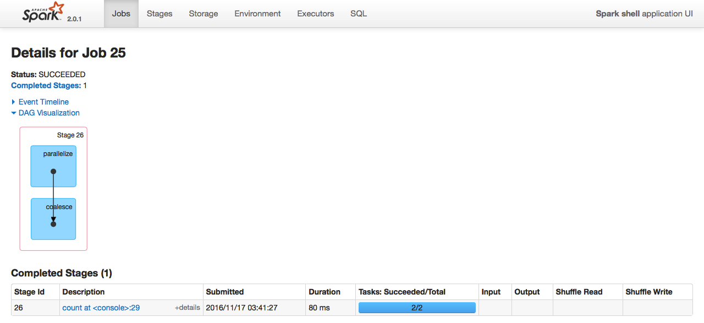 
spark web UI运行效果之job信息（有shuffle）：
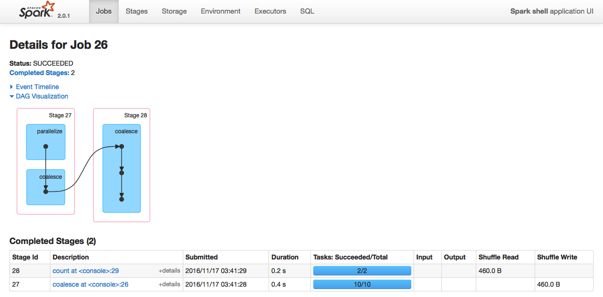 
可见无shuffle的重分区，job划分为一个stage，  
可见有shuffle的重分区，job划分为两个stage。  
shuffle是stage划分的依据，出现了shuffle也就意味着要划分stage了。  


---
##collect
```
def collect(): Array[T]
def collect[U: ClassTag](f: PartialFunction[T, U]): RDD[U]
```
将rdd从spark的集群中分布式内存空间，返回到client端的内存空间。类型转换为原生的Array类型。  
如果rdd的容量太大，很有可能造成client端的内存溢出。所有尽量只提取rdd中的一部分元素。  
运行代码：
``` 
val c = sc.parallelize(List("zhangsan", "lisi", "wangwu", "zhaoliu"), 6)
c.collect
```
代码详解：
```
//1.创建6分区的rdd
scala> val c = sc.parallelize(List("zhangsan", "lisi", "wangwu", "zhaoliu"), 6)
c: org.apache.spark.rdd.RDD[String] = ParallelCollectionRDD[40] at parallelize at <console>:24

//2.显示rdd的内容
scala> c.collect
res82: Array[String] = Array(zhangsan, lisi, wangwu, zhaoliu)
```
spark web UI运行效果之job信息：
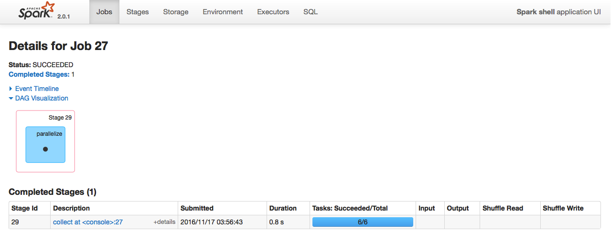 


---
##collectAsync
```

```
collect的异步操作方式  
运行代码：
``` 
val c = sc.parallelize(List("zhangsan", "lisi", "wangwu", "zhaoliu"), 6)
val d=c.collectAsync
d.value
d.get
```
代码详解：
```
//1.创建6分区的rdd
scala> val c = sc.parallelize(List("zhangsan", "lisi", "wangwu", "zhaoliu"), 6)
c: org.apache.spark.rdd.RDD[String] = ParallelCollectionRDD[50] at parallelize at <console>:24

//2.异步获取rdd的内容
scala> val d=c.collectAsync
d: org.apache.spark.FutureAction[Seq[String]] = org.apache.spark.SimpleFutureAction@3c6c7659

//3.从FutureAction中取值
scala> d.value
res102:Option[scala.util.Try[Seq[String]]]=Some(Success(WrappedArray(zhangsan,lisi,wangwu,zhaoliu)))

//4.从FutureAction中取值
scala> d.get
res103: Seq[String] = WrappedArray(zhangsan, lisi, wangwu, zhaoliu)

```
spark web UI运行效果之job信息：
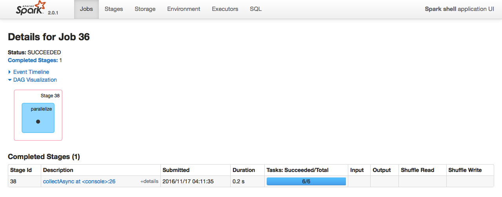 

---
##compute
```
Executes dependencies and computes the actual representation of the RDD.  
This function should not be called directly by users.
```
compute是有spark框架自行调用的方法，用户不能直接调用。

---
##context
获取rdd的上下文，实际上就是org.apache.spark.SparkContext。  
运行代码：
``` 
val a = sc.parallelize(List("zhangsan", "lisi", "wangwu", "zhaoliu"), 6)
val c1=a.context

val b = sc.parallelize(List("zhangsan", "lisi", "wangwu", "zhaoliu"), 6)
val c2=b.context

c1==c2
```
代码详解：
```
//1.创建一个rdd，并获取它的上下文件
scala> val a = sc.parallelize(List("zhangsan", "lisi", "wangwu", "zhaoliu"), 6)
a: org.apache.spark.rdd.RDD[String] = ParallelCollectionRDD[51] at parallelize at <console>:24

scala> val c1=a.context
c1: org.apache.spark.SparkContext = org.apache.spark.SparkContext@60577d30


//2.创建另一个rdd，并获取它的上下文件
scala> val b = sc.parallelize(List("zhangsan", "lisi", "wangwu", "zhaoliu"), 6)
b: org.apache.spark.rdd.RDD[String] = ParallelCollectionRDD[52] at parallelize at <console>:24

scala> val c2=b.context
c2: org.apache.spark.SparkContext = org.apache.spark.SparkContext@60577d30

//3.两个rdd的上下文是相同的。实际上在spark-shell环境中所有rdd的上下文都是同一个SparkContext实例。
scala> c1==c2
res105: Boolean = true
```
---
##copy?

---
##count
```
def count(): Long
```
计算rdd中元素的个数，返回Long类型的数据到client端。  
运行代码：
``` 
val a = sc.parallelize(List("zhangsan", "lisi", "wangwu", "zhaoliu"), 6)
a.count
```
代码详解：
```
//1.创建6分区的rdd
scala> val a = sc.parallelize(List("zhangsan", "lisi", "wangwu", "zhaoliu"), 6)
a: org.apache.spark.rdd.RDD[String] = ParallelCollectionRDD[55] at parallelize at <console>:24

//1.计算rdd中元素的个数
scala> a.count
res107: Long = 4
```

---
##countApprox
```
def (timeout: Long, confidence: Double = 0.95): PartialResult[BoundedDouble]
```
在超过一定时间算超时的情况下估算rdd的元素的个数。  
运行代码：
``` 
val a = sc.parallelize(1 to 10000, 200)
val b = a++a++a++a++a
b.countApprox(10000,1)
```
代码详解：
```
//1.创建20分区的rdd
scala> val a = sc.parallelize(1 to 10000, 200)
a: org.apache.spark.rdd.RDD[Int] = ParallelCollectionRDD[81] at parallelize at <console>:24

scala> val b = a++a++a++a++a
b: org.apache.spark.rdd.RDD[Int] = UnionRDD[85] at $plus$plus at <console>:26

//2.在100毫秒超时的情况下估算rdd的元素个数
scala> b.countApprox(10000,1)
[Stage 49:====================================================>(996 + 3) / 1000]
res117: org.apache.spark.partial.PartialResult[org.apache.spark.partial.BoundedDouble] = 
(final: [50000.000, 50000.000])

```
spark web UI运行效果之job信息：
 
---
##countApproxDistinct
```
def countApproxDistinct(relativeSD: Double = 0.05): Long
参数说明：
relativeSD：误差率，值越小越准确。误差率取值范围为：accuracy (1.7E-5)
```
在一定的精确率的情况下下计算rdd元素去重后的数量，如果rdd的元素巨大，精确度要求不需要十分准确，  
可以使用之，它比count速度快，准度低。  
运行代码：
``` 
val a = sc.parallelize(1 to 10000, 200)
val b = a++a++a++a++a
b.countApproxDistinct(0.1)
```
代码详解：
```
//1.创建200分区的rdd
scala> val a = sc.parallelize(1 to 10000, 200)
a: org.apache.spark.rdd.RDD[Int] = ParallelCollectionRDD[66] at parallelize at <console>:24

scala> val b = a++a++a++a++a
b: org.apache.spark.rdd.RDD[Int] = UnionRDD[70] at $plus$plus at <console>:26

//1.模糊计算去重后元素的个数
scala> b.countApproxDistinct(0.1)
res114: Long = 8224
```
spark web UI运行效果之job信息：
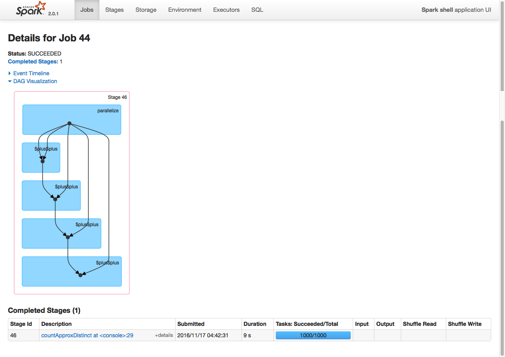 

---
##countAsync
异步计算rdd元素的个数。  
运行代码：
``` 
val a = sc.parallelize(1 to 10, 20)
val b = a++a++a
val c = b.countAsync
c.value
c.get
```
代码详解：
```
//1.创建20分区的rdd
scala> val a = sc.parallelize(1 to 10, 20)
a: org.apache.spark.rdd.RDD[Int] = ParallelCollectionRDD[159] at parallelize at <console>:24

scala> val b = a++a++a
b: org.apache.spark.rdd.RDD[Int] = UnionRDD[161] at $plus$plus at <console>:26

//2.进行异步计算
scala> val c = b.countAsync
c: org.apache.spark.FutureAction[Long] = org.apache.spark.SimpleFutureAction@54f4c11d

//3.获取异步计算的结果
scala> c.value
res148: Option[scala.util.Try[Long]] = Some(Success(30))

scala> c.get
res149: Long = 30

```
spark web UI运行效果之job信息：
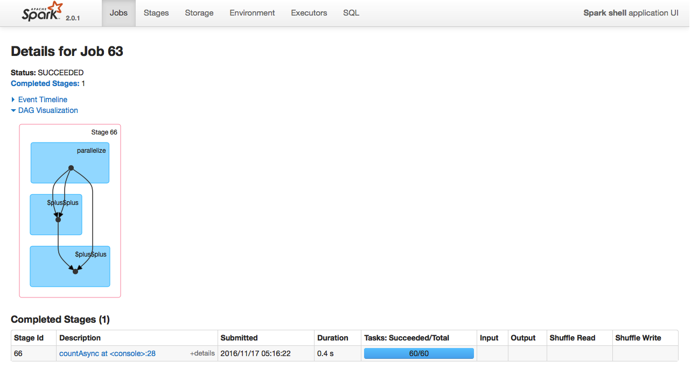 


---
##countByValue
```
def countByValue(): Map[T, Long]
```
计算rdd中元素的个数,并以value进行分组.这个操作最终会把聚合的信息用一个reduce进行处理，  
意味着此方法可能产生shuffle，会将job划分为不同的stage.  
运行代码：
``` 
val a = sc.parallelize(List(4,2,3,4,5,6,7,8,2,4,2,1,6,1,8,1))
a.countByValue
```
代码详解：
```
//1.创建rdd
scala> val a = sc.parallelize(List(4,2,3,4,5,6,7,8,2,4,2,1,6,1,8,1))
a: org.apache.spark.rdd.RDD[Int] = ParallelCollectionRDD[162] at parallelize at <console>:24

//2.以元素进行分组，计算元素的个数
scala> a.countByValue
res151: scala.collection.Map[Int,Long] = Map(
5 -> 1,
1 -> 3, 
6 -> 2, 
2 -> 3, 
7 -> 1, 
3 -> 1, 
8 -> 2,
4 -> 3)
```
spark web UI运行效果之job信息：
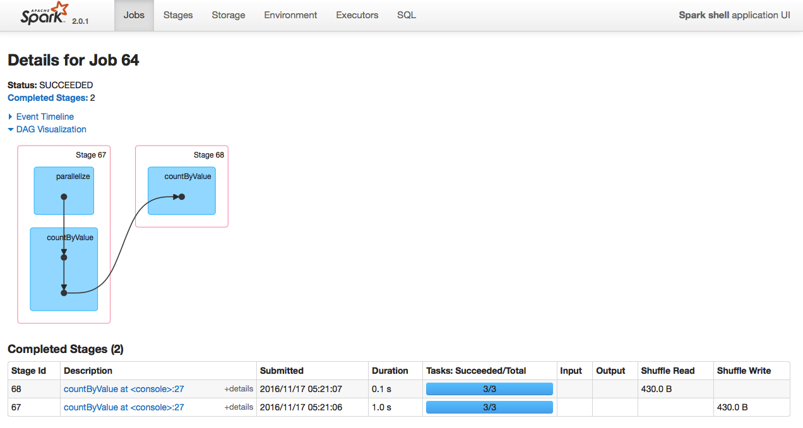 

---
##countByValueApprox

在超过一定时间算超时的情况下估算rdd的元素的个数，结果以value进行分组。  
运行代码：
``` 
val a = sc.parallelize(List(4,2,3,4,5,6,7,8,2,4,2,1,6,1,8,1))
val b = a.countByValueApprox(10000,0.95)
```
代码详解：
```
//1.创建rdd
scala> val a = sc.parallelize(List(4,2,3,4,5,6,7,8,2,4,2,1,6,1,8,1))
a: org.apache.spark.rdd.RDD[Int] = ParallelCollectionRDD[168] at parallelize at <console>:24

//2.在1000毫秒内合法，精确率95%，统计rdd中每个元素的个数。
scala> val b = a.countByValueApprox(10000,0.95)
b:org.apache.spark.partial.PartialResult[scala.collection.Map[Int,org.apache.spark.
partial.BoundedDouble]]= (final: Map(
1 -> [3.000, 3.000], 
2 -> [3.000, 3.000],
3 -> [1.000, 1.000], 
4 -> [3.000, 3.000],
5 -> [1.000, 1.000],
6 -> [2.000, 2.000],
7 -> [1.000, 1.000], 
8 -> [2.000, 2.000]))
```
spark web UI运行效果之job信息：
 
---
##dependencies
用于查询rdd的依赖关系，此方法用的不多，了解即可。  
运行代码：
``` 
val a = sc.parallelize(1 to 100, 200)
val b = a.map(_*2)
val c = b.filter(_%22==0)

val d=c.dependencies
```
代码详解：
```
//1.准备rdd的依赖关系
scala> val a = sc.parallelize(1 to 100, 200)
a: org.apache.spark.rdd.RDD[Int] = ParallelCollectionRDD[200] at parallelize at <console>:24

scala> val b = a.map(_*2)
b: org.apache.spark.rdd.RDD[Int] = MapPartitionsRDD[201] at map at <console>:26

scala> val c = b.filter(_%22==0)
c: org.apache.spark.rdd.RDD[Int] = MapPartitionsRDD[202] at filter at <console>:28

//2.查看rdd的依赖关系
scala> val d=c.dependencies
d: Seq[org.apache.spark.Dependency[_]] = List(org.apache.spark.OneToOneDependency@393efcdd)

```

---
##distinct([numTasks]))
```
def distinct(): RDD[T]
def distinct(numPartitions: Int): RDD[T]

参数说明：
参数numPartitions：表示分区数量。也就是任务数量。

官方说明：
Return a new dataset that contains the distinct elements of the source dataset.
```

对RDD中的元素进行去重操作。  
###distinct示例一：基本用法
执行代码：
```
var rdd =  sc.parallelize(Seq(1,2,2,3,4,3,4,5))
rdd.collect

rdd.distinct
rdd.collect
```
代码解释：
```
//1.创建rdd并显示
scala> var rdd =  sc.parallelize(Seq(1,2,2,3,4,3,4,5))
rdd: org.apache.spark.rdd.RDD[Int] = ParallelCollectionRDD[206] at parallelize at <console>:24

scala> rdd.collect
res181: Array[Int] = Array(1, 2, 2, 3, 4, 3, 4, 5)

//2.对rdd元素去重并显示
scala> rdd.distinct
res182: org.apache.spark.rdd.RDD[Int] = MapPartitionsRDD[209] at distinct at <console>:27

scala> rdd.collect
res183: Array[Int] = Array(1, 2, 2, 3, 4, 3, 4, 5)
```
spark web UI运行效果之job信息：
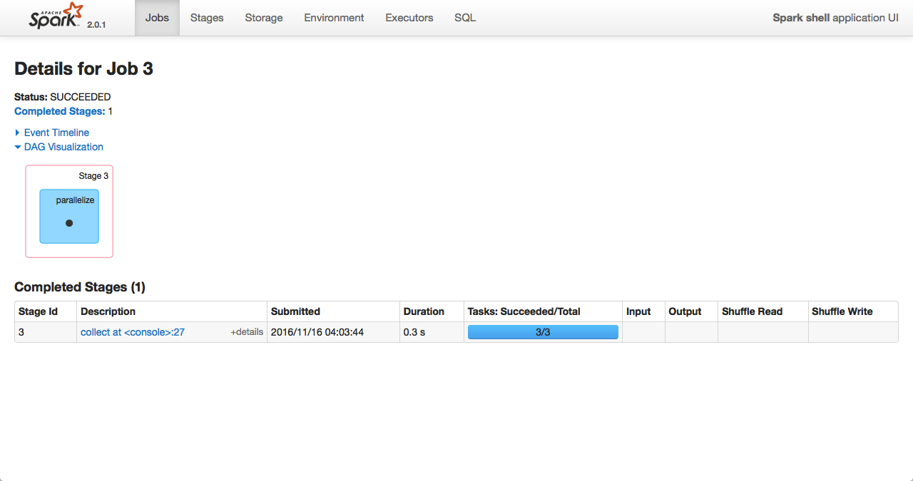 

###distinct示例二：高级用法
执行代码：
```
val a = sc.parallelize(List("Gnu", "Cat", "Rat", "Dog", "Gnu", "Rat"), 2)
val b=a.distinct
b.collect
b.partitions.length
b.partitions.size

val c=a.distinct(3)
c.collect
c.partitions.length
c.partitions.size
```
代码解释：
```
//1.创建2分区rdd
scala> val a = sc.parallelize(List("Gnu", "Cat", "Rat", "Dog", "Gnu", "Rat"), 2)
a: org.apache.spark.rdd.RDD[String] = ParallelCollectionRDD[135] at parallelize at <console>:27

//2.不指定分区去重
scala> val b=a.distinct
b: org.apache.spark.rdd.RDD[String] = MapPartitionsRDD[138] at distinct at <console>:29

scala> b.collect
res113: Array[String] = Array(Dog, Cat, Gnu, Rat)

//2.1使用partitions.length查看分区数
scala> b.partitions.length
res114: Int = 2

//2.2使用partitions.size查看分区数
scala> b.partitions.size
res115: Int = 2


//3.指定分区去重
scala> val c=a.distinct(3)
c: org.apache.spark.rdd.RDD[String] = MapPartitionsRDD[141] at distinct at <console>:29

scala> c.collect
res116: Array[String] = Array(Dog, Rat, Cat, Gnu)

scala> c.partitions.length
res117: Int = 3

scala> c.partitions.size
res118: Int = 3
```
spark web UI运行效果之job信息：
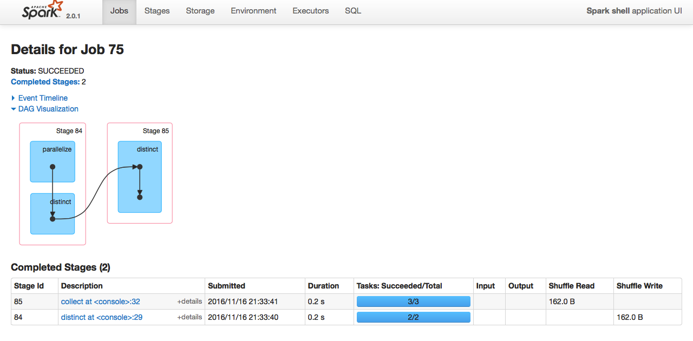 

---
##filter(func)
```
def filter(f: T => Boolean): RDD[T]
```
过滤rdd中满足条件的元素，不满足条件的元素被丢弃，满足条件的元素被重新生成到一个rdd中。   
新生成的rdd与父rdd的分区一致  
执行代码：
```
val a = sc.makeRDD(1 to 10,4)
val b = a.filter(e=>e%2==0)
b.collect
b.partitions.size
```
代码解释：
```
//1.创建4分区rdd
scala> val a = sc.makeRDD(1 to 10,4)
a: org.apache.spark.rdd.RDD[Int] = ParallelCollectionRDD[83] at makeRDD at <console>:27

//2.对rdd进行过滤，保留偶数元素
scala> val b = a.filter(e=>e%2==0)
b: org.apache.spark.rdd.RDD[Int] = MapPartitionsRDD[84] at filter at <console>:29

scala> b.collect
res69: Array[Int] = Array(2, 4, 6, 8, 10)

//3.分区数与父rdd一致
scala> b.partitions.size
res68: Int = 4
```
spark web UI运行效果之job信息：
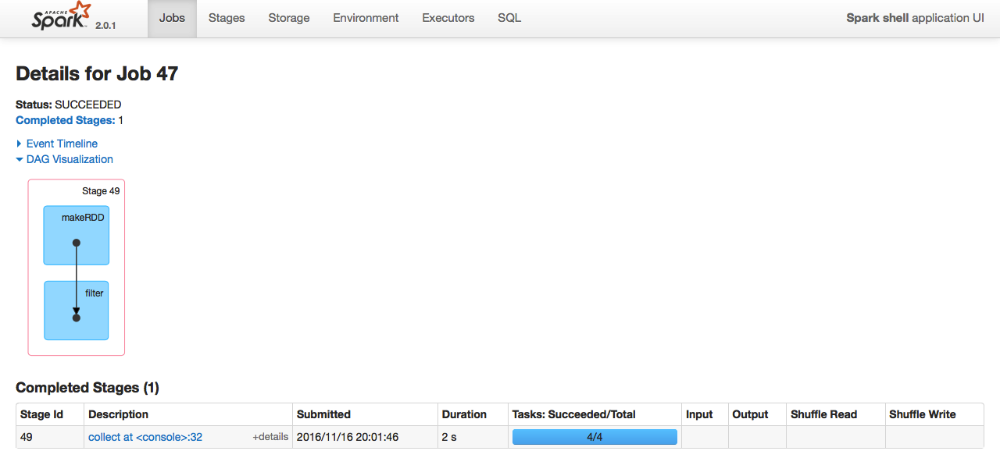 

---
##first
```
def first(): T
```
获取rdd中的第一个元素。  
运行代码：
``` 
val c = sc.parallelize(List("Gnu", "Cat", "Rat", "Dog"), 2)
c.first
```
代码详解：
```
//1.创建rdd
scala> val c = sc.parallelize(List("Gnu", "Cat", "Rat", "Dog"), 2)
c: org.apache.spark.rdd.RDD[String] = ParallelCollectionRDD[203] at parallelize at <console>:24

//2.获取第一元素
scala> c.first
res179: String = Gnu
```


---
##flatMap()
```
def flatMap[U: ClassTag](f: T => TraversableOnce[U]): RDD[U]
```
与map类似，区别是原RDD中的元素经map处理后只能生成一个元素，而原RDD中的元素经flatmap处理后可生成多个元素  
执行代码：
``` 
val rdd1 = sc.parallelize(6 to 9, 3)
val rdd2 = rdd1.flatMap(x => 5 to x)
rdd2.collect
```
代码解释：
```
//1.创建一个3个分区的rdd    
scala> val rdd1 = sc.parallelize(6 to 9, 3)
rdd1: org.apache.spark.rdd.RDD[Int] = ParallelCollectionRDD[204] at parallelize at <console>:24

//2.将rdd1通过flatMap进行转换
scala> val rdd2 = rdd1.flatMap(x => 5 to x)
rdd2: org.apache.spark.rdd.RDD[Int] = MapPartitionsRDD[205] at flatMap at <console>:26

//3.显示转换结果
scala> rdd2.collect
res180: Array[Int] = Array(
5, 6, 
5, 6, 7, 
5, 6, 7, 8, 
5, 6, 7, 8, 9)
```
spark web UI运行效果之job信息：
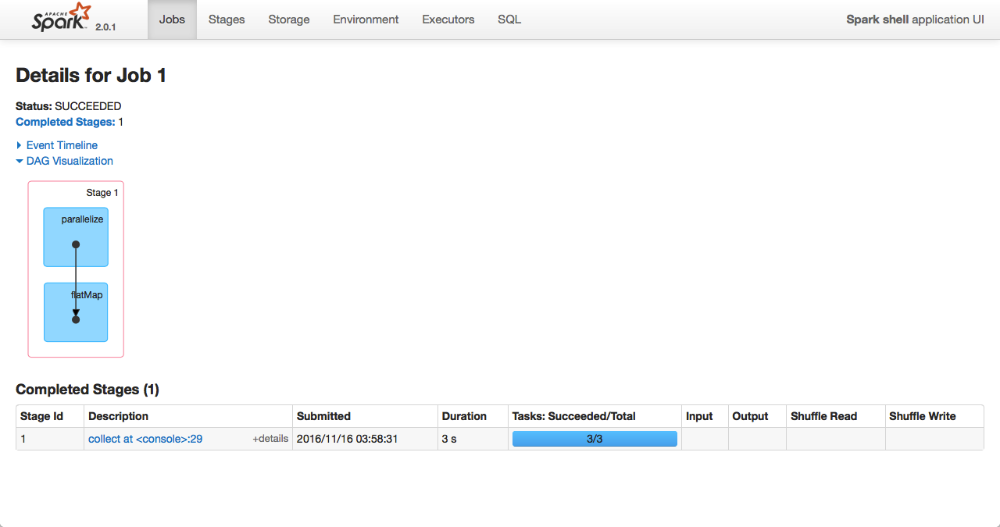 

---
##fold
```
def fold(zeroValue: T)(op: (T, T) => T): T
```
fold是aggregate的简化，将aggregate中的seqOp和combOp使用同一个函数op。  
运行代码：
``` 
var rdd1 = sc.makeRDD(1 to 10,2)
val a = rdd1.fold(1)(
	{(x : Int,y : Int) => x + y}
)
rdd1.mapPartitionsWithIndex{(partIdx,iter) => {
	  var part_map = scala.collection.mutable.Map[String,List[Int]]()
	    while(iter.hasNext){
	      var part_name = "part_" + partIdx;
	      var elem = iter.next()
	      if(part_map.contains(part_name)) {
	        var elems = part_map(part_name)
	        elems ::= elem
	        part_map(part_name) = elems
	      } else {
	        part_map(part_name) = List[Int]{elem}
	      }
	    }
	    part_map.iterator
	}
}.collect
```
代码详解：
```
//1.创建2分区rdd
scala> var rdd1 = sc.makeRDD(1 to 10,2)
rdd1: org.apache.spark.rdd.RDD[Int] = ParallelCollectionRDD[224] at makeRDD at <console>:24

//2.执行fold操作
scala> val a = rdd1.fold(1)(
     |     {(x : Int,y : Int) => x + y}
     | )
a: Int = 58

//3.查看rdd每个分区中的内容
scala> rdd1.mapPartitionsWithIndex{(partIdx,iter) => {
     |       var part_map = scala.collection.mutable.Map[String,List[Int]]()
     |         while(iter.hasNext){
     |           var part_name = "part_" + partIdx;
     |           var elem = iter.next()
     |           if(part_map.contains(part_name)) {
     |             var elems = part_map(part_name)
     |             elems ::= elem
     |             part_map(part_name) = elems
     |           } else {
     |             part_map(part_name) = List[Int]{elem}
     |           }
     |         }
     |         part_map.iterator
     |     }
     | }.collect
res203:Array[(String,List[Int])]=Array((part_0,List(5, 4, 3, 2, 1)),(part_1,List(10, 9, 8, 7, 6)))


//4.第一个结果的推理过程
//4.1分区内的元素
第一个分区中包含5,4,3,2,1
第二个分区中包含10,9,8,7,6

//4.2各个分区内元素要执行的函数
先在每个分区中迭代执行 (x : Int,y : Int) => x + y 并且使用zeroValue的值1
part_0中 zeroValue+5+4+3+2+1 = 1+5+4+3+2+1 = 16
part_1中 zeroValue+10+9+8+7+6 = 1+10+9+8+7+6 = 41

//4.3分区结果间要执行的函数
再将两个分区的结果合并(x : Int,y : Int) => x + y  ，并且使用zeroValue的值1
zeroValue+part_0+part_1 = 1 + 16 + 41 = 58
```
spark web UI运行效果之job信息：
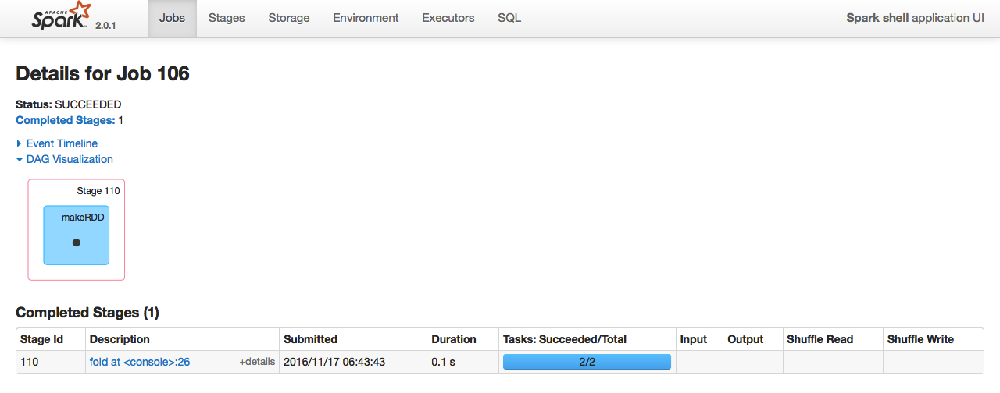 

---
##foreach
```
def foreach(f: T => Unit)
```
对rdd中的没个元素，执行一个自定义的操作。  
运行代码：
``` 
val a = sc.parallelize(List("zhangsan", "lisi", "wangwu", "zhaoliu"), 2)
val b = a.foreach(x => x + "is a student")

zhangsan is a student
```
代码详解：
```
//1.创建rdd
val a = sc.parallelize(List("zhangsan", "lisi", "wangwu", "zhaoliu"), 2)
val b = a.foreach(x => x + "is a student")

//2.输出结果
zhangsan is a student
lisi is a student
wangwu is a student
zhaoliu is a student
```


参考链接  
http://homepage.cs.latrobe.edu.au/zhe/ZhenHeSparkRDDAPIExamples.html#mapPartitions
http://spark.apache.org/docs/latest/programming-guide.html

http://lxw1234.com/archives/2015/07/363.htm