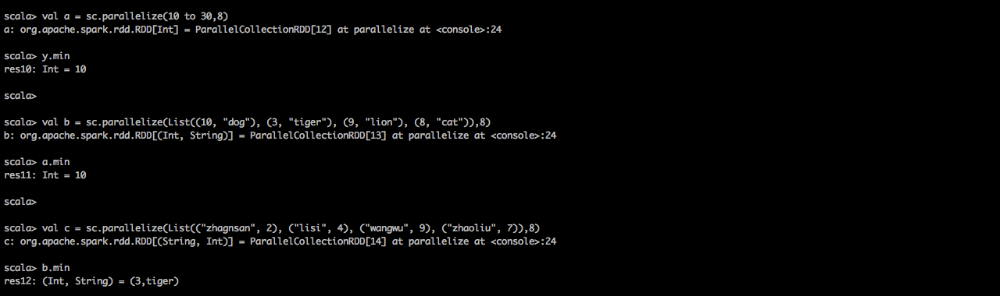

#spark core API之RDD的API

spark2.0在RDD层面上为我们提供了84个算子，应付日常的数据处理已经基本够用了，通过组合这些算子，我们能写出非常棒的数据处理程序。
 


##map()
```
map()方法是将一个RDD转化成另一个rdd。其实是rdd的每个partition开启一个线程进行转化。
输入分区与输出分区一对一，即：有多少个输入分区，就有多少个输出分区。map方法对rdd的每个元素
执行一次操作，操作单位是元素。mapPartition()方法是map()方法的变种，它是对rdd的每个partition
执行一次操作，操作单位是分区。有些情况下mapPartition()方法的执行效率要比map()方法要高，那是因为
mapPartition()的处理粒度比map()较大。
```
方法原型：
```
def map[U: ClassTag](f: T => U): RDD[U]
```
###map示例一
执行代码：
```
var rdd = sc.parallelize((1 to 10),5)
var mapResult=rdd.map(_*2)
mapResult.collect
```
执行解释：
```
//1.从本地内存中创建一个5分区的RDD
var rdd = sc.parallelize((1 to 10),5)

//2.rdd的每个元素都乘以2
var mapResult=rdd.map(_*2)

//3.将单词显示出来
mapResult.collect
```
spark shell运行效果：
 
spark web UI运行效果之job信息：
 
###map示例二
执行代码：
```
var rdd = sc.textFile("hdfs://qingcheng12:9000/input/spark/README.md",18)
var mapResult=rdd.map(_.split("\\s+"))
mapResult.collect
```
执行解释：
```
//1.从hdfs文件中创建一个18分区的RDD
var rdd = sc.textFile("hdfs://qingcheng12:9000/input/spark/README.md",18)

//2.将文件中的每一个行用空白查分成单词
var mapResult=rdd.map(_.split("\\s+"))

//3.将单词显示出来
mapResult.collect
```
spark shell运行效果：
 
spark web UI运行效果之job信息：
 
###map示例三  
map也可以把Key变成Key-Value对.  
执行代码：
```
val rdd1 = sc.parallelize(List("dog", "tiger", "lion", "cat", "panther", " eagle"), 3)
val rdd2 = a.map(x => (x, 1))
rdd2.collect.foreach(println(_))
```
执行解释：
```
//1.创建3分区的rdd
val rdd1 = sc.parallelize(List("dog", "tiger", "lion", "cat", "panther", " eagle"), 3)

//2.将单个元素的rdd转化为键值对的rdd
val rdd2 = a.map(x => (x, 1))

//3.将结果显示出来
rdd2.collect.foreach(println(_))
```
spark shell运行效果：
 
spark web UI运行效果之job信息：
 


##flatMap()
```
def flatMap[U: ClassTag](f: T => TraversableOnce[U]): RDD[U]
```
与map类似，区别是原RDD中的元素经map处理后只能生成一个元素，而原RDD中的元素经flatmap处理后可生成多个元素  
执行代码：
``` 
val rdd1 = sc.parallelize(6 to 9, 3)
val rdd2 = rdd1.flatMap(x => 5 to x)
rdd2.collect
```
代码解释：
```
//1.创建一个3个分区的rdd       
val rdd1 = sc.parallelize(6 to 9, 3)

//2.将rdd1通过flatMap进行转换
val rdd2 = rdd1.flatMap(x => 5 to x)

//3.显示转换结果
rdd2.collect

//4.其结果可以表示为如下形式
Array[Int] = Array(
5, 6, 
5, 6, 7, 
5, 6, 7, 8, 
5, 6, 7, 8, 9)
```
spark shell运行效果：
 
spark web UI运行效果之job信息：
 


##mapValues()
```
def mapValues[U](f: V => U): RDD[(K, U)]
```
原RDD中的Key保持不变，与新的Value一起组成新的RDD中的元素。因此，该函数只适用于元素为KV对的RDD。   
执行代码：
``` 
val rdd1 = sc.parallelize(List((1,"zhangsan"), (2,"lisi"),(3,"wangwu"),(4,"zhaoliu")), 4)
rdd1.collect
val rdd2=rdd1.mapValues(v=>v.toUpperCase())
rdd2.collect
```
代码解释：
```
//1.创建key:value类型的RDD
val rdd1 = sc.parallelize(List((1,"zhangsan"), (2,"lisi"),(3,"wangwu"),(4,"zhaoliu")), 4)
rdd1.collect

//2.key不变，只转化value
val rdd2=rdd1.mapValues(v=>v.toUpperCase())
rdd2.collect
```
spark shell运行效果：
 
spark web UI运行效果之job信息：
 


##flatMapValues()
```
def flatMapValues[U](f: V => TraversableOnce[U]): RDD[(K, U)]
```

与mapValues类似，区别是原RDD中的元素经mapValues处理后只能生成一个元素，而原RDD中的元素经flatMapValues处理后可生成多个元素.   
执行代码：
``` 
val rdd1 = sc.parallelize(List((1,2),(2,3),(3,4)), 3)
val rdd2 = rdd1.flatMapValues(x => 0 to x)
rdd2.collect
```
代码解释：
```
//1.创建3分区的key:value键值对RDD
val rdd1 = sc.parallelize(List((1,2),(2,3),(3,4)), 3)

//2.key不变，每个value产生一组元素（0-value）
val rdd2 = rdd1.flatMapValues(x => 0 to x)

//3.显示结果
rdd2.collect

//4.其结果可以表示为如下形式
Array[(Int, Int)] =Array(
(1,0), (1,1), (1,2),
(2,0), (2,1), (2,2), (2,3), 
(3,0), (3,1), (3,2), (3,3), (3,4)
)
```
spark shell运行效果：
 
spark web UI运行效果之job信息：
 


##mapPartitions()
```
mapPartitions是map的一个变种。map的输入函数是应用于RDD中每个元素，
而mapPartitions的输入函数是应用于每个分区，也就是把每个分区中的内容作为整体来处理的。 
该函数和map函数类似，只不过映射函数的参数由RDD中的每一个元素变成了RDD中每一个分区的迭代器。
如果在映射的过程中需要频繁创建额外的对象，使用mapPartitions要比map高效的过。
比如，将RDD中的所有数据通过JDBC连接写入数据库，如果使用map函数，可能要为每一个元素都创建一个connection，
这样开销很大，如果使用mapPartitions，那么只需要针对每一个分区建立一个connection。
```
函数定义：
```
def mapPartitions[U: ClassTag](f: Iterator[T] => Iterator[U], preservesPartitioning:
Boolean = false): RDD[U]
参数preservesPartitioning表示是否保留父RDD的partitioner分区信息。
```
###mapPartitions示例一
执行代码：
```
val rdd = sc.parallelize(1 to 9, 3)
def myfunc[T](iter: Iterator[T]) : Iterator[(T, T)] = {
  var res = List[(T, T)]()
  var pre = iter.next
  while (iter.hasNext){
    val cur = iter.next;
    res .::= (pre, cur)
    pre = cur;
  }
  res.iterator
}
a.mapPartitions(myfunc).collect
```
spark shell运行效果：
 
spark web UI运行效果之job信息：
 

###mapPartitions示例二
执行代码：
```
val x = sc.parallelize((1 to 9), 3)
def myfunc(iter: Iterator[Int]) : Iterator[Int] = {
  var res = List[Int]()
  while (iter.hasNext) {
    val cur = iter.next;
    res = res ::: List.fill(2)(cur)
  }
  res.iterator
}
x.mapPartitions(myfunc).collect
```
spark shell运行效果：
 
spark web UI运行效果之job信息：
 

###mapPartitions示例三
执行代码：
```
var rdd1 = sc.makeRDD(1 to 6, 2)
rdd1.partitions.size
var rdd2 = rdd1.mapPartitions {
    x =>{
        var result = List[Int] ()
        var i = 0
        while (x.hasNext) {
            i += x.next()
        }
        result.::(i).iterator
    }
}
rdd2.partitions.size
rdd2.collect
```

代码解释：
```
//1.创建2分区的RDD
scala> var rdd1 = sc.makeRDD(1 to 6, 2)
rdd1: org.apache.spark.rdd.RDD[Int] = ParallelCollectionRDD[58] at makeRDD at <console>:27

scala> rdd1.partitions.size
res46: Int = 2

//2.对rdd进行mapPartitions操作，实际上是对rdd的每个分区进行一次操作，
//本例中是对每个分区的元素进行累加
scala> var rdd2 = rdd1.mapPartitions {
     |     x =>{
     |         var result = List[Int] ()
     |         var i = 0
     |         while (x.hasNext) {
     |             i += x.next()
     |         }
     |         result.::(i).iterator
     |     }
     | }
rdd2: org.apache.spark.rdd.RDD[Int] = MapPartitionsRDD[59] at mapPartitions at <console>:31

//3.分区数没有变化，与rdd1的分区数是一致的
scala> rdd2.partitions.size
res47: Int = 2

//4.分区一的累加和为6，分区二的累加和为15
scala> rdd2.collect
res48: Array[Int] = Array(6, 15)
```
spark shell运行效果：
 
spark web UI运行效果之job信息：
 

##mapPartitionsWithIndex()
函数作用同mapPartitions，不过提供了两个参数，第一个参数为分区的索引。
```
def mapPartitionsWithIndex[U](f: (Int, Iterator[T]) => Iterator[U], 
preservesPartitioning: Boolean = false)(implicit arg0: ClassTag[U]): RDD[U]
```
执行代码：
```
var rdd1 = sc.makeRDD(1 to 20,4)

rdd1.mapPartitionsWithIndex{
  (partIdx,iter) => {
    var part_map = scala.collection.mutable.Map[String,List[Int]]()
      while(iter.hasNext){
        var part_name = "part_" + partIdx;
        var elem = iter.next()
        if(part_map.contains(part_name)) {
          var elems = part_map(part_name)
          elems ::= elem
          part_map(part_name) = elems
        } else {
          part_map(part_name) = List[Int]{elem}
        }
      }
      part_map.iterator
     
  }
}.collect

rdd1.mapPartitionsWithIndex {
    (partIdx, iter) =>{
        var part_map = scala.collection.mutable.Map[String, Int]()
        while (iter.hasNext) {
            var part_name = "part_" + partIdx;
            if (part_map.contains(part_name)) {
                var ele_cnt = part_map(part_name)
                part_map(part_name) = ele_cnt + 1
            } else {
                part_map(part_name) = 1
            }
            iter.next()
        }
        part_map.iterator
    }
}.collect

rdd1.mapPartitionsWithIndex{
(partIdx,iter) => {
  var result = List[String]()
    var sum = 0
    while(iter.hasNext){
      sum += iter.next()
    }
    result.::("partitionId="+partIdx+"|partitionSum=" + sum).iterator
   
}
}.collect
```
代码解释：
```
//1.创建4分区的rdd
scala> var rdd1 = sc.makeRDD(1 to 20,4)
rdd1: org.apache.spark.rdd.RDD[Int] = ParallelCollectionRDD[76] at makeRDD at <console>:27

//2.查看rdd的每个分区的元素的内容
scala> rdd1.mapPartitionsWithIndex{
     |   (partIdx,iter) => {
     |     var part_map = scala.collection.mutable.Map[String,List[Int]]()
     |       while(iter.hasNext){
     |         var part_name = "part_" + partIdx;
     |         var elem = iter.next()
     |         if(part_map.contains(part_name)) {
     |           var elems = part_map(part_name)
     |           elems ::= elem
     |           part_map(part_name) = elems
     |         } else {
     |           part_map(part_name) = List[Int]{elem}
     |         }
     |       }
     |       part_map.iterator
     |
     |   }
     | }.collect
res61: Array[(String, List[Int])] = Array((part_0,List(5, 4, 3, 2, 1)), 
(part_1,List(10, 9, 8, 7, 6)),(part_2,List(15, 14, 13, 12, 11)), (part_3,List(20, 19, 18, 17, 16)))

//3.查看rdd的每个分区的元素的个数
scala> rdd1.mapPartitionsWithIndex {
     |     (partIdx, iter) =>{
     |         var part_map = scala.collection.mutable.Map[String, Int]()
     |         while (iter.hasNext) {
     |             var part_name = "part_" + partIdx;
     |             if (part_map.contains(part_name)) {
     |                 var ele_cnt = part_map(part_name)
     |                 part_map(part_name) = ele_cnt + 1
     |             } else {
     |                 part_map(part_name) = 1
     |             }
     |             iter.next()
     |         }
     |         part_map.iterator
     |     }
     | }.collect
res62: Array[(String, Int)] = Array((part_0,5), (part_1,5), (part_2,5), (part_3,5))


//4.计算rdd的每个分区的元素的累加和
scala> rdd1.mapPartitionsWithIndex{
     | (partIdx,iter) => {
     |   var result = List[String]()
     |     var sum = 0
     |     while(iter.hasNext){
     |       sum += iter.next()
     |     }
     |     result.::("partitionId="+partIdx+"|partitionSum=" + sum).iterator
     |
     | }
     | }.collect
res63: Array[String] = Array(partitionId=0|partitionSum=15, partitionId=1|partitionSum=40, 
partitionId=2|partitionSum=65, partitionId=3|partitionSum=90)
```
spark shell运行效果：
 
 
 

##reduce()
reduce将RDD中元素前两个传给输入函数，产生一个新的return值，新产生的return值与RDD中下一个元素（第三个元素）  
组成两个元素，再被传给输入函数，直到最后只有一个值为止。
执行代码：
```
val a = sc.parallelize(1 to 100,10)
a.reduce((x, y) => x + y)
```
代码解释：
```
//1.创建10分区的RDD
val a = sc.parallelize(1 to 100,10)

//2.对rdd的元素进行reduce操作
a.reduce((x, y) => x + y)
```
spark shell运行效果：
 
spark web UI运行效果之job信息：
 
spark web UI运行效果之stages信息：
 
可以看出所有的Locality Level都是PROCESS_LOCAL，说明都是在本机内存中处理的。
 
可以分析出：  
```
1.qingcheng11上有5个分区，5个线程执行。  
2.qingcheng12上有3个分区，3个线程执行。  
3.qingcheng13上有2个分区，2个线程执行。  
```


##reduceByKey(func, [numTasks])
```
def reduceByKey(func: (V, V) => V): RDD[(K, V)]
def reduceByKey(func: (V, V) => V, numPartitions: Int): RDD[(K, V)]
def reduceByKey(partitioner: Partitioner, func: (V, V) => V): RDD[(K, V)]

官方解释：
When called on a dataset of (K, V) pairs, returns a dataset of (K, V) pairs where 
the values for each key are aggregated using the given reduce function func, which 
must be of type (V,V) => V. Like in groupByKey, the number of reduce tasks is configurable
through an optional second argument.
```

reduceByKey就是根据Key把相同元素的Value进行reduce操作，Key相同的多个元素的值被reduce为一个值，  
然后与原RDD中的Key组成一个新的KV对。reduceByKey只元素为键值对的RDD。     
###reduceByKey示例一
执行代码：
```
val a = sc.parallelize(List((1,20),(1,32),(3,41),(3,29)))
val b = a.reduceByKey((x,y) => x + y)
b.collect
```
代码解释：
```
//1.创建key:value类型的RDD
val a = sc.parallelize(List((1,20),(1,32),(3,41),(3,29)))

//2.根据key进行reduce操作
val b = a.reduceByKey((x,y) => x + y)

//3.显示结果
b.collect
```
spark shell运行效果：
 
spark web UI运行效果之job信息：
 


###reduceByKey示例二
执行代码：
```
val l=List(("zhangsan",3120),("lisi",3120),("zhangsan",3180),("wagnwu",2908),("lisi",2340))
val a = sc.parallelize(l)
val b = a.reduceByKey((x,y) => x + y)
b.collect
```
代码解释：
```
//1.创建key:value类型的RDD
val l=List(("zhangsan",3120),("lisi",3120),("zhangsan",3180),("wagnwu",2908),("lisi",2340))
val a = sc.parallelize(l)

//2.根据key进行reduce操作
val b = a.reduceByKey((x,y) => x + y)

//3.显示结果
b.collect
```
spark shell运行效果：
 
spark web UI运行效果之job信息：
 


##reduceByKeyLocally(func)
```
def reduceByKeyLocally(func: (V, V) => V): Map[K, V]
```
该函数将RDD[K,V]中每个K对应的V值根据映射函数来运算，运算结果映射到一个Map[K,V]中，而不是RDD[K,V]。   
执行代码：
```
var rdd1 = sc.makeRDD(Array(("A",0),("A",2),("B",1),("B",2),("C",1)))
rdd1.reduceByKeyLocally((x,y) => x + y)
```
代码解释：
```
//1.创建rdd
scala> var rdd1 = sc.makeRDD(Array(("A",0),("A",2),("B",1),("B",2),("C",1)))
rdd1: org.apache.spark.rdd.RDD[(String, Int)] = ParallelCollectionRDD[171] at makeRDD at <console>:27

//2.以key为准进行reduce操作，并把结果输出到本地的Map中，而不是rdd中。
scala> rdd1.reduceByKeyLocally((x,y) => x + y)
res140: scala.collection.Map[String,Int] = Map(A -> 2, B -> 3, C -> 1)
```
spark shell运行效果：
 
spark web UI运行效果之job信息：
 


##filter(func)
```
def filter(f: T => Boolean): RDD[T]
```
过滤rdd中满足条件的元素，不满足条件的元素被丢弃，满足条件的元素被重新生成到一个rdd中。   
新生成的rdd与父rdd的分区一致  
执行代码：
```
val a = sc.makeRDD(1 to 10,4)
val b = a.filter(e=>e%2==0)
b.collect
b.partitions.size
```
代码解释：
```
//1.创建4分区rdd
scala> val a = sc.makeRDD(1 to 10,4)
a: org.apache.spark.rdd.RDD[Int] = ParallelCollectionRDD[83] at makeRDD at <console>:27

//2.对rdd进行过滤，保留偶数元素
scala> val b = a.filter(e=>e%2==0)
b: org.apache.spark.rdd.RDD[Int] = MapPartitionsRDD[84] at filter at <console>:29

scala> b.collect
res69: Array[Int] = Array(2, 4, 6, 8, 10)

//3.分区数与父rdd一致
scala> b.partitions.size
res68: Int = 4
```
spark shell运行效果：
 
spark web UI运行效果之job信息：
 


##sample(withReplacement, fraction, seed)
```
def sample(withReplacement: Boolean, fraction: Double, seed: Int): RDD[T]

官方解释：
    Sample a fraction fraction of the data, with or without replacement, using a 
    given random number generator seed.
```
以指定的随机种子随机抽样出数量为fraction的数据，withReplacement表示是抽出的数据是否放回，  
true为有放回的抽样，false为无放回的抽样.  
执行代码：
```
val a = sc.parallelize(1 to 100, 3)
val b = a.sample(false, 0.1, 0)
b.collect
b.count

val c = a.sample(true, 0.3, 0)
c.collect
c.count

val d = a.sample(true, 0.3, 13)
d.collect
d.count
```
代码解释：
```
//1.创建3分区rdd
scala> val a = sc.parallelize(1 to 100, 3)
a: org.apache.spark.rdd.RDD[Int] = ParallelCollectionRDD[93] at parallelize at <console>:27

//2.从RDD中随机且无放回的抽出10%的数据，随机种子值为0（即可能以0的为起始值）
scala> val b = a.sample(false, 0.1, 0)
b: org.apache.spark.rdd.RDD[Int] = PartitionwiseSampledRDD[94] at sample at <console>:29

scala> b.collect
res75: Array[Int] = Array(10, 47, 55, 73, 76, 84, 87, 88, 91, 92, 95, 98)

scala> b.count
res76: Long = 12

//3.从RDD中随机且有放回的抽出30%的数据，随机种子值为0（即可能以0的为起始值）
scala> val c = a.sample(true, 0.3, 0)
c: org.apache.spark.rdd.RDD[Int] = PartitionwiseSampledRDD[95] at sample at <console>:29

scala> c.collect
res77: Array[Int] = Array(4, 9, 10, 14, 14, 17, 22, 22, 23, 23, 25, 26, 26, 26, 33, 38,
 42, 43, 50, 57, 63, 63, 63, 69, 70, 71, 71, 72, 82, 89, 92, 95, 97)

scala> c.count
res78: Long = 33

//4.从RDD中随机且有放回的抽出30%的数据，随机种子值为13（即可能以1-13中的任意一个为起始值）
scala> val d = a.sample(true, 0.3, 13)
d: org.apache.spark.rdd.RDD[Int] = PartitionwiseSampledRDD[96] at sample at <console>:29

scala> d.collect
res79: Array[Int] = Array(1, 2, 4, 5, 8, 10, 20, 29, 33, 33, 41, 50, 56, 58, 62, 65, 66, 69,
 84, 84, 90, 93, 94, 97)
 
scala> d.count
res80: Long = 24
```
spark web UI运行效果之job信息：
 


##union(otherDataset)
```
def union(other: RDD[T]): RDD[T]

官方解释：
    Return a new dataset that contains the union of the elements in
    the source dataset and the argument.
```
将两个RDD中的数据集进行合并，最终返回两个RDD的并集。即使RDD中存在相同的元素也不会去重.
产生新的rdd中的分区数是原来两个rdd分区数之和，并且保留了rdd的顺序。  
执行代码：
```
val a = sc.parallelize(1 to 3, 4)
val b = sc.parallelize(6 to 9, 5)
val c=a.union(b)
c.collect
c.partitions.size

val d=(a ++ b)
d.collect
d.partitions.size

val e=b.union(a)
e.collect
e.partitions.size

val f=(b ++ a)
f.collect
f.partitions.size
```
代码解释：
```

scala> val a = sc.parallelize(1 to 3, 4)
a: org.apache.spark.rdd.RDD[Int] = ParallelCollectionRDD[102] at parallelize at <console>:27
scala> val b = sc.parallelize(6 to 9, 5)
b: org.apache.spark.rdd.RDD[Int] = ParallelCollectionRDD[103] at parallelize at <console>:27


scala> val c=a.union(b)
c: org.apache.spark.rdd.RDD[Int] = UnionRDD[104] at union at <console>:31


//1.创建两个rdd,一个4分区，一个5分区
scala> val a = sc.parallelize(1 to 3, 4)
a: org.apache.spark.rdd.RDD[Int] = ParallelCollectionRDD[108] at parallelize at <console>:27

scala> val b = sc.parallelize(2 to 5, 5)
b: org.apache.spark.rdd.RDD[Int] = ParallelCollectionRDD[109] at parallelize at <console>:27

//2.union方式合并rdd，产生新的rdd,新rdd的是原来两个rdd元素的并集，有重复元素，分区数是两个rdd分区数之和。
scala> val c=a.union(b)
c: org.apache.spark.rdd.RDD[Int] = UnionRDD[110] at union at <console>:31

scala> c.collect
res95: Array[Int] = Array(1, 2, 3, 2, 3, 4, 5)

scala> c.partitions.size
res96: Int = 9


//3.++方式合并rdd，产生新的rdd,新rdd的是原来两个rdd元素的并集，有重复元素，分区数是两个rdd分区数之和。
scala> val d=(a ++ b)
d: org.apache.spark.rdd.RDD[Int] = UnionRDD[111] at $plus$plus at <console>:31

scala> d.collect
res97: Array[Int] = Array(1, 2, 3, 2, 3, 4, 5)

scala> d.partitions.size
res98: Int = 9

//4.union方式合并rdd，产生新的rdd,新rdd的是原来两个rdd元素的并集，有重复元素，分区数是两个rdd分区数之和。
scala> val e=b.union(a)
e: org.apache.spark.rdd.RDD[Int] = UnionRDD[112] at union at <console>:31

scala> e.collect
res99: Array[Int] = Array(2, 3, 4, 5, 1, 2, 3)

scala> e.partitions.size
res100: Int = 9

//5.++方式合并rdd，产生新的rdd,新rdd的是原来两个rdd元素的并集，有重复元素，分区数是两个rdd分区数之和。
scala> val f=(b ++ a)
f: org.apache.spark.rdd.RDD[Int] = UnionRDD[113] at $plus$plus at <console>:31

scala> f.collect
res101: Array[Int] = Array(2, 3, 4, 5, 1, 2, 3)

scala> f.partitions.size
res102: Int = 9
```
spark web UI运行效果之job信息：
 

##intersection(otherDataset)
```
def intersection(other: RDD[T], numPartitions: Int): RDD[T]
def intersection(other: RDD[T], partitioner: Partitioner)(implicit ord: Ordering[T] = null): RDD[T]
def intersection(other: RDD[T]): RDD[T]
参数说明：
参数numPartitions指定返回的RDD的分区数。
参数partitioner用于指定分区函数  
官方解释：
Return a new RDD that contains the intersection of elements in the source dataset and the argument.
```
该函数返回两个RDD的交集，并且去重。

执行代码：
```
var rdd1 = sc.makeRDD(1 to 5,2)
var rdd2 = sc.makeRDD(2 to 6,4)

val a=rdd1.intersection(rdd2)
a.collect
a.partitions.size

var b = rdd2.intersection(rdd1,3)
b.collect
b.partitions.size
```
代码解释：
```
//1.创建两个rdd，一个2分区，一个4分区
scala> var rdd1 = sc.makeRDD(1 to 5,2)
rdd1: org.apache.spark.rdd.RDD[Int] = ParallelCollectionRDD[114] at makeRDD at <console>:27

scala> var rdd2 = sc.makeRDD(2 to 6,4)
rdd2: org.apache.spark.rdd.RDD[Int] = ParallelCollectionRDD[115] at makeRDD at <console>:27

//2.求两个rdd的交集，
scala> val a=rdd1.intersection(rdd2)
a: org.apache.spark.rdd.RDD[Int] = MapPartitionsRDD[121] at intersection at <console>:31

//2.1元素内容保留了两个rdd的顺序，并没有排序,但是去掉了重复元素
scala> a.collect
res103: Array[Int] = Array(4, 5, 2, 3)

//2.2不指定分区，默认以两个rdd的分区数最大的为准
scala> a.partitions.size
res104: Int = 4

//3.求两个rdd的交集，指定分区，则重新计算分区。保留rdd顺序，去掉重复元素
scala> var b = rdd2.intersection(rdd1,3)
b: org.apache.spark.rdd.RDD[Int] = MapPartitionsRDD[127] at intersection at <console>:31

scala> b.collect
res105: Array[Int] = Array(3, 4, 5, 2)

scala> b.partitions.size
res106: Int = 3
```
spark shell运行效果：
 
spark web UI运行效果之job信息：
 


##subtract(otherDataset)

```
def subtract(other: RDD[T]): RDD[T]
def subtract(other: RDD[T], numPartitions: Int): RDD[T]
def subtract(other: RDD[T], p: Partitioner): RDD[T]

参数说明：
参数numPartitions用于指定分区数；
参数partitioner用于指定分区函数；
```

该函数类似于intersection，但返回在RDD中出现，并且不在otherRDD中出现的元素，不去重。

执行代码：
```
var rdd1 = sc.makeRDD(1 to 5,2)
var rdd2 = sc.makeRDD(2 to 6,4)

val a=rdd1.subtract(rdd2)
a.collect
a.partitions.size

var b = rdd2.subtract(rdd1,3)
b.collect
b.partitions.size
```
代码解释：
```
//1.创建两个rdd，一个2分区，一个4分区
scala> var rdd1 = sc.makeRDD(1 to 5,2)
rdd1: org.apache.spark.rdd.RDD[Int] = ParallelCollectionRDD[145] at makeRDD at <console>:27

scala> var rdd2 = sc.makeRDD(2 to 6,4)
rdd2: org.apache.spark.rdd.RDD[Int] = ParallelCollectionRDD[146] at makeRDD at <console>:27

//2.求两个rdd的差集
scala> val a=rdd1.subtract(rdd2)
a: org.apache.spark.rdd.RDD[Int] = MapPartitionsRDD[150] at subtract at <console>:31

scala> a.collect
res120: Array[Int] = Array(1)

//2.1不指定分区，默认以两个rdd的分区数最小的为准
scala> a.partitions.size
res121: Int = 2


//3.求两个rdd的查集，指定分区，则重新计算分区。
scala> var b = rdd2.subtract(rdd1,3)
b: org.apache.spark.rdd.RDD[Int] = MapPartitionsRDD[154] at subtract at <console>:31

scala> b.collect
res122: Array[Int] = Array(6)

scala> b.partitions.size
res123: Int = 3
```
spark shell运行效果：
 
spark web UI运行效果之job信息：
 


##subtractByKey(otherDataset[Pair])

```
def subtractByKey[W: ClassTag](other: RDD[(K, W)]): RDD[(K, V)]
def subtractByKey[W: ClassTag](other: RDD[(K, W)], numPartitions: Int): RDD[(K, V)]
def subtractByKey[W: ClassTag](other: RDD[(K, W)], p: Partitioner): RDD[(K, V)]

参数说明：
参数numPartitions用于指定分区数；
参数partitioner用于指定分区函数；
```

该函数类似于subtract，只不过它只能作用于key:value类型的rdd。以key为准求两个rdd元素之间的差集。

执行代码：
```
val al=List(("dog",5),("lion",4), ("tiger",2), ("cat",9), ("eagle",7),("spider",6))
val a = sc.parallelize(al,4)
val bl=List(("ant",2),("lion",2), ("tiger",9), ("falcon",4), ("eagle",8),("squid",3))
val b = sc.parallelize(bl,5)

val c = a.subtractByKey(b)
c.collect
c.partitions.size

val d = b.subtractByKey(a)
d.collect
d.partitions.size
```
代码解释：
```
//1.创建两个rdd，一个4分区，一个5分区
scala> val al=List(("dog",5),("lion",4), ("tiger",2), ("cat",9), ("eagle",7),("spider",6))
al: List[(String, Int)] = List((dog,5), (lion,4), (tiger,2), (cat,9), (eagle,7), (spider,6))
scala> val a = sc.parallelize(al,4)
a: org.apache.spark.rdd.RDD[(String, Int)] = ParallelCollectionRDD[163]
at parallelize at <console>:29

scala> val bl=List(("ant",2),("lion",2), ("tiger",9), ("falcon",4), ("eagle",8),("squid",3))
bl: List[(String, Int)] = List((ant,2), (lion,2), (tiger,9), (falcon,4), (eagle,8), (squid,3))
scala> val b = sc.parallelize(bl,5)
b: org.apache.spark.rdd.RDD[(String, Int)] = ParallelCollectionRDD[164]
at parallelize at <console>:29

//2.保留在a中差去b的元素
scala> val c = a.subtractByKey(b)
c: org.apache.spark.rdd.RDD[(String, Int)] = SubtractedRDD[161] at subtractByKey at <console>:31

scala> c.collect
res128: Array[(String, Int)] = Array((dog,5), (spider,6), (cat,9))

//2.1生成的新rdd以a的分区数为准
scala> c.partitions.size
res129: Int = 4

//3.保留在b中差去a的元素
scala> val d = b.subtractByKey(a)
d: org.apache.spark.rdd.RDD[(String, Int)] = SubtractedRDD[162] at subtractByKey at <console>:31

scala> d.collect
res130: Array[(String, Int)] = Array((squid,3), (falcon,4), (ant,2))

//3.1生成的新rdd以b的分区数为准
scala> d.partitions.size
res131: Int = 5

```
spark shell运行效果：
 
spark web UI运行效果之job信息：
 


##distinct([numTasks]))

```
def distinct(): RDD[T]
def distinct(numPartitions: Int): RDD[T]

参数说明：
参数numPartitions：表示分区数量。也就是任务数量。

官方说明：
Return a new dataset that contains the distinct elements of the source dataset.
```

对RDD中的元素进行去重操作。  
###distinct示例一：基本用法
执行代码：
```
var rdd =  sc.parallelize(Seq(1,2,2,3,4,3,4,5))
rdd.collect

rdd.distinct
rdd.collect
```
代码解释：
```
//1.创建rdd并显示
var rdd =  sc.parallelize(Seq(1,2,2,3,4,3,4,5))
rdd.collect

//2.对rdd元素去重并显示
rdd.distinct
rdd.collect
```
spark shell运行效果：
 
spark web UI运行效果之job信息：
 

###distinct示例一：高级用法
执行代码：
```
val a = sc.parallelize(List("Gnu", "Cat", "Rat", "Dog", "Gnu", "Rat"), 2)
val b=a.distinct
b.collect
b.partitions.length
b.partitions.size

val c=a.distinct(3)
c.collect
c.partitions.length
c.partitions.size
```
代码解释：
```
//1.创建2分区rdd
scala> val a = sc.parallelize(List("Gnu", "Cat", "Rat", "Dog", "Gnu", "Rat"), 2)
a: org.apache.spark.rdd.RDD[String] = ParallelCollectionRDD[135] at parallelize at <console>:27

//2.不指定分区去重
scala> val b=a.distinct
b: org.apache.spark.rdd.RDD[String] = MapPartitionsRDD[138] at distinct at <console>:29

scala> b.collect
res113: Array[String] = Array(Dog, Cat, Gnu, Rat)

//2.1使用partitions.length查看分区数
scala> b.partitions.length
res114: Int = 2

//2.2使用partitions.size查看分区数
scala> b.partitions.size
res115: Int = 2


//3.指定分区去重
scala> val c=a.distinct(3)
c: org.apache.spark.rdd.RDD[String] = MapPartitionsRDD[141] at distinct at <console>:29

scala> c.collect
res116: Array[String] = Array(Dog, Rat, Cat, Gnu)

scala> c.partitions.length
res117: Int = 3

scala> c.partitions.size
res118: Int = 3
```
spark shell运行效果：
 
spark web UI运行效果之job信息：
 


##groupByKey([numTasks])

```
def groupByKey(): RDD[(K, Iterable[V])]
def groupByKey(numPartitions: Int): RDD[(K, Iterable[V])]
def groupByKey(partitioner: Partitioner): RDD[(K, Iterable[V])]

参数说明：
参数numPartitions用于指定分区数；
参数partitioner用于指定分区函数；

官方说明：
When called on a dataset of (K, V) pairs, returns a dataset of (K, Iterable<V>) pairs. 
Note: If you are grouping in order to perform an aggregation (such as a sum or average) 
over each key, using reduceByKey or aggregateByKey will yield much better performance. 
Note: By default, the level of parallelism in the output depends on the number of partitions 
of the parent RDD. You can pass an optional numTasks argument to set a different number of tasks.

```

该函数用于将RDD[K,V]中每个K对应的V值，合并到一个集合Iterable[V]中，

执行代码：
```
val rdd1 = sc.makeRDD(Array(("shandong",0),("henan",2),("shandong",1),("bejingi",5),("henan",8)))
val rdd2 = rdd1.groupByKey()
rdd2.collect
```
代码解释：
```
//1.创建key:value类型的rdd
scala>val rdd1=sc.makeRDD(Array(("shandong",0),("henan",2),("shandong",1),("bejingi",5),("henan",8)))
rdd1: org.apache.spark.rdd.RDD[(String, Int)] = ParallelCollectionRDD[143] at makeRDD at <console>:27

//2.以key进行分组
scala> val rdd2 = rdd1.groupByKey()
rdd2:org.apache.spark.rdd.RDD[(String,Iterable[Int])]=ShuffledRDD[144] at groupByKey at <console>:29

//3.显示分组结果
scala> rdd2.collect
res119: Array[(String, Iterable[Int])] = Array(
(henan,CompactBuffer(2, 8)), 
(shandong,CompactBuffer(0, 1)),
(bejingi,CompactBuffer(5)))
```
spark shell运行效果：
 
spark web UI运行效果之job信息：
 


##groupBy([numTasks])
```
def groupBy[K: ClassTag](f: T => K): RDD[(K, Iterable[T])]
def groupBy[K: ClassTag](f: T => K, numPartitions: Int): RDD[(K, Iterable[T])]
def groupBy[K: ClassTag](f: T => K, p: Partitioner): RDD[(K, Iterable[T])]

参数说明：
参数numPartitions用于指定分区数；
参数partitioner用于指定分区函数；
```

该函数用于将RDD中的元素，用指定的方式进行分组。     
####groupBy示例一：基本用法  
执行代码：
```
val a = sc.parallelize(1 to 9, 3)
val b = a.groupBy(x => { if (x % 2 == 0) "even" else "odd" })
b.collect
b.partitions.size

def myfunc(a: Int) : Int ={
  a % 2
}
a.groupBy(x => myfunc(x), 3).collect
a.groupBy(myfunc(_), 4).collect
```
代码解释：
```

scala> val a = sc.parallelize(1 to 9, 3)
a: org.apache.spark.rdd.RDD[Int] = ParallelCollectionRDD[177] at parallelize at <console>:27


scala> val b = a.groupBy(x => { if (x % 2 == 0) "even" else "odd" })
b: org.apache.spark.rdd.RDD[(String, Iterable[Int])] = ShuffledRDD[179] at groupBy at <console>:31


scala> b.collect
res143: Array[(String, Iterable[Int])] = Array((even,CompactBuffer(4, 6, 2, 8)), (odd,
CompactBuffer(1, 3, 7, 9, 5)))

scala> b.partitions.size
res144: Int = 3


//1.创建3分区的rdd
scala> val a = sc.parallelize(1 to 9, 3)
a: org.apache.spark.rdd.RDD[Int] = ParallelCollectionRDD[180] at parallelize at <console>:27

//2.对rdd中的元素按奇偶数进行分组
scala> val b = a.groupBy(x => { if (x % 2 == 0) "even" else "odd" })
b: org.apache.spark.rdd.RDD[(String, Iterable[Int])] = ShuffledRDD[182] at groupBy at <console>:31

//3.显示结果及分区（不指定分区，默认与父rdd分区一致）
scala> b.collect
res156: Array[(String, Iterable[Int])] = Array((even,CompactBuffer(4, 6, 2, 8)), (odd,
CompactBuffer(1, 3, 5, 7, 9)))

scala> b.partitions.size
res157: Int = 3


//4.定义函数
scala> def myfunc(a: Int) : Int ={
     |   a % 2
     | }
myfunc: (a: Int)Int
//5.运用函数进行分区，并指定分区
scala> a.groupBy(x => myfunc(x), 3).collect
res158: Array[(Int, Iterable[Int])] = Array((0,CompactBuffer(2, 4, 6, 8)), 
(1,CompactBuffer(5, 7, 9, 1, 3)))

//6.运用函数进行分区，并指定分区
scala> a.groupBy(myfunc(_), 4).collect
res159: Array[(Int, Iterable[Int])] = Array((0,CompactBuffer(2, 4, 6, 8)), 
(1,CompactBuffer(7, 9, 1, 3, 5)))
```
spark shell运行效果：
 
spark web UI运行效果之job信息：
 

####groupBy示例一：高级用法  

执行代码：
```
class MyPartitioner extends org.apache.spark.Partitioner{
def numPartitions: Int = 8
def getPartition(key: Any): Int =
{
    key match
    {
      case null     => 0
      case key: Int => key          % numPartitions
      case _        => key.hashCode % numPartitions
    }
  }
  override def equals(other: Any): Boolean =
  {
    other match
    {
      case h: MyPartitioner => true
      case _                => false
    }
  }
}
val p = new MyPartitioner()
val a = sc.parallelize(1 to 9, 3)
val b = a.groupBy((x:Int) => { x }, p)
b.collect
```
代码解释：
```
//1.自定义分区类
scala> class MyPartitioner extends org.apache.spark.Partitioner{
     | def numPartitions: Int = 8
     | def getPartition(key: Any): Int =
     | {
     |     key match
     |     {
     |       case null     => 0
     |       case key: Int => key          % numPartitions
     |       case _        => key.hashCode % numPartitions
     |     }
     |   }
     |   override def equals(other: Any): Boolean =
     |   {
     |     other match
     |     {
     |       case h: MyPartitioner => true
     |       case _                => false
     |     }
     |   }
     | }
defined class MyPartitioner

//2.创建自定义分区对象
scala> val p = new MyPartitioner()
p: MyPartitioner = MyPartitioner@236f6eba

//3.创建3分区rdd
scala> val a = sc.parallelize(1 to 9, 3)
a: org.apache.spark.rdd.RDD[Int] = ParallelCollectionRDD[192] at parallelize at <console>:29

//4.使用自定义的分区对象，对rdd的元素进行分组
scala> val b = a.groupBy((x:Int) => { x }, p)
b: org.apache.spark.rdd.RDD[(Int, Iterable[Int])] = ShuffledRDD[194] at groupBy at <console>:36

//5.显示分组效果
scala> b.collect
res166: Array[(Int, Iterable[Int])] = Array(
(8,CompactBuffer(8)), (1,CompactBuffer(1)), (9,CompactBuffer(9)),
(2,CompactBuffer(2)), (3,CompactBuffer(3)), (4,CompactBuffer(4)), 
(5,CompactBuffer(5)), (6,CompactBuffer(6)), (7,CompactBuffer(7)))

```
spark shell运行效果：
 
spark web UI运行效果之job信息：
 


##min()
```
def min()(implicit ord: Ordering[T]): T
```
返回rdd中最小的元素。 返回的是元素，不是rdd，因此这个操作不存在rdd的转化。    
执行代码：
```
val a = sc.parallelize(10 to 30,8)
y.min

val b = sc.parallelize(List((10, "dog"), (3, "tiger"), (9, "lion"), (8, "cat")),8)
a.min

val c = sc.parallelize(List(("zhagnsan", 2), ("lisi", 4), ("wangwu", 9), ("zhaoliu", 7)),8)
b.min
```
代码解释：
```
//1.创建8分区的rdd
scala> val a = sc.parallelize(10 to 30,8)
a: org.apache.spark.rdd.RDD[Int] = ParallelCollectionRDD[12] at parallelize at <console>:24

//2.找出rdd中最小的元素
scala> y.min
res10: Int = 10

//3.创建8分区key:value类型的rdd
scala> val b = sc.parallelize(List((10, "dog"), (3, "tiger"), (9, "lion"), (8, "cat")),8)
b: org.apache.spark.rdd.RDD[(Int, String)] = ParallelCollectionRDD[13] at parallelize at <console>:24

//4.找出rdd中最小的元素，以key最小的为准。
scala> a.min
res11: Int = 10

//5.如果key为string类型，按字母顺序依次比较
scala> val c = sc.parallelize(List(("zhagnsan", 2), ("lisi", 4), ("wangwu", 9), ("zhaoliu", 7)),8)
c: org.apache.spark.rdd.RDD[(String, Int)] = ParallelCollectionRDD[14] at parallelize at <console>:24

scala> b.min
res12: (Int, String) = (3,tiger)
```
spark shell运行效果：
 
spark web UI运行效果之job信息：
 


##max()
```
def max()(implicit ord: Ordering[T]): T
```
返回rdd中最大的元素。返回的是元素，不是rdd，因此这个操作不存在rdd的转化。   
执行代码：
```
val a = sc.parallelize(10 to 30,8)
y.max

val b = sc.parallelize(List((10, "dog"), (3, "tiger"), (9, "lion"), (8, "cat")),8)
y.max

val c = sc.parallelize(List(("zhagnsan", 2), ("lisi", 4), ("wangwu", 9), ("zhaoliu", 7)),8)
y.max
```
代码解释：
```
//1.创建8分区的rdd
scala> val a = sc.parallelize(10 to 30,8)
a: org.apache.spark.rdd.RDD[Int] = ParallelCollectionRDD[15] at parallelize at <console>:24

//2.找出rdd中最大的元素
scala> y.max
res13: Int = 30

//3.创建8分区key:value类型的rdd
scala> val b = sc.parallelize(List((10, "dog"), (3, "tiger"), (9, "lion"), (8, "cat")),8)
b: org.apache.spark.rdd.RDD[(Int, String)] = ParallelCollectionRDD[16] at parallelize at <console>:24

//4.找出rdd中最小的元素，以key最大的为准。
scala> y.max
res14: Int = 30


//5.如果key为string类型，按字母顺序依次比较
scala> val c = sc.parallelize(List(("zhagnsan", 2), ("lisi", 4), ("wangwu", 9), ("zhaoliu", 7)),8)
c: org.apache.spark.rdd.RDD[(String, Int)] = ParallelCollectionRDD[17] at parallelize at <console>:24

scala> y.max
res15: Int = 30
```
spark shell运行效果：
 
spark web UI运行效果之job信息：
 


参考链接
http://homepage.cs.latrobe.edu.au/zhe/ZhenHeSparkRDDAPIExamples.html#mapPartitions
http://spark.apache.org/docs/latest/programming-guide.html


         


