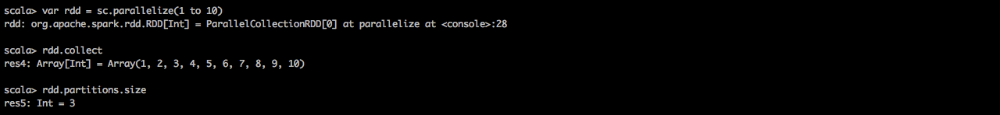
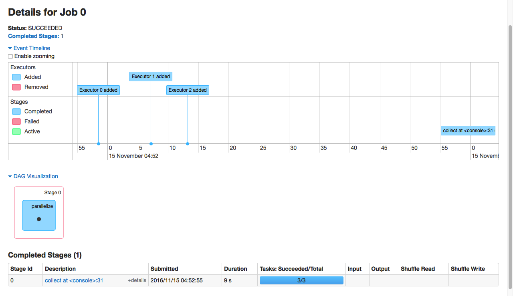
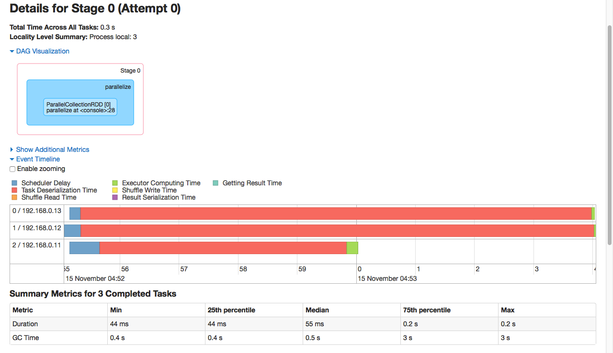
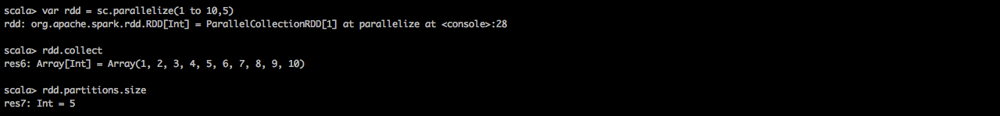
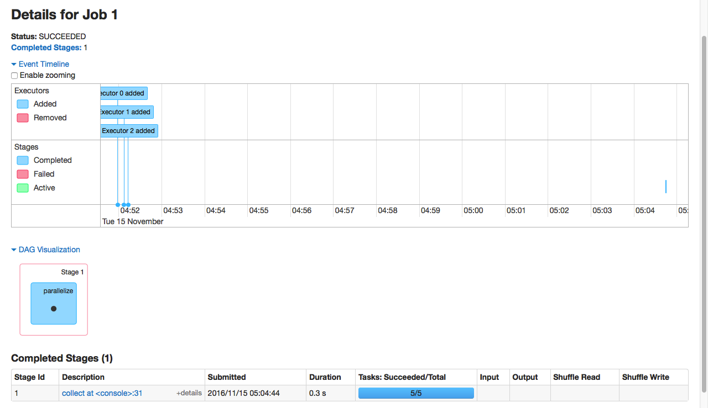
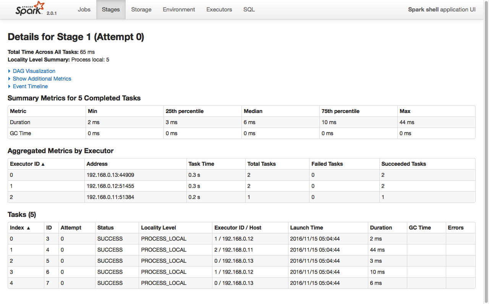
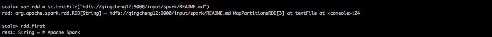
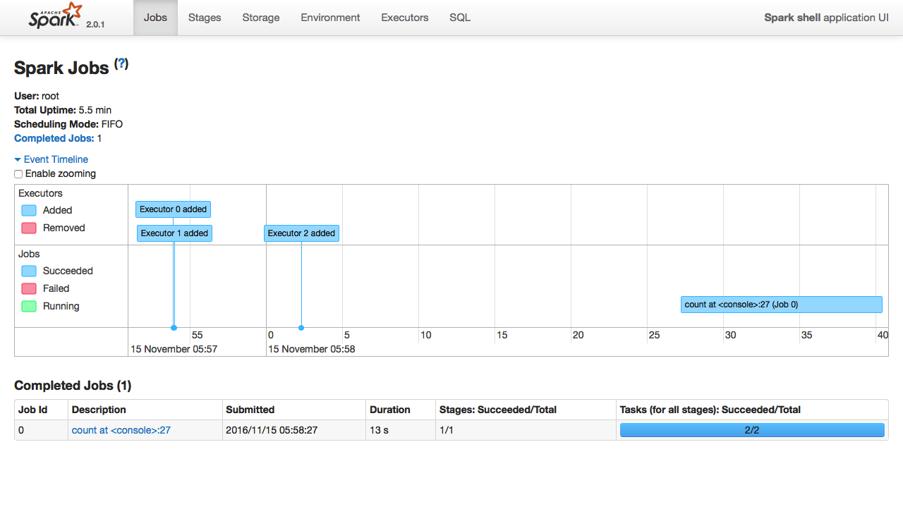
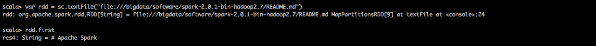
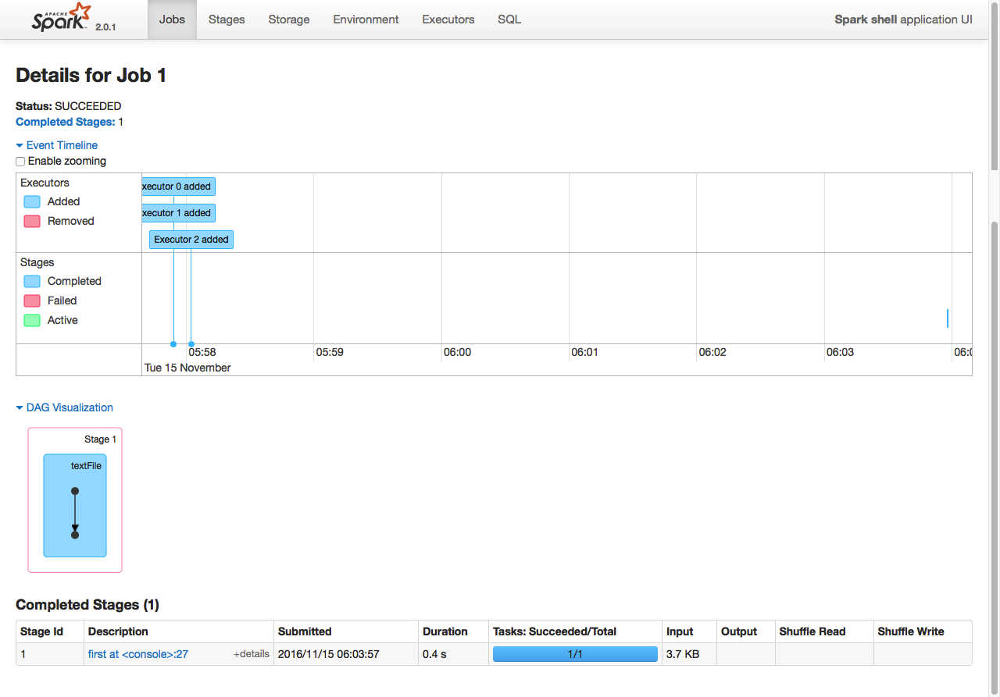

#spark core API之创建RDD
##1.使用parallelize()方法从本地变量创建RDD

方法解释：
```
方法原型：
    def parallelize[T](seq: Seq[T], numSlices: Int = defaultParallelism)(implicit arg0: ClassTag[T]): RDD[T]
方法作用：
    从一个本地内存的Seq集合创建为一个分布式内存的RDD。
参数解释：
    参数1：Seq集合，必须。
    参数2：numSlices分区数，默认为该Application分配到的资源的CPU核数
```

###示例一：parallelize()不指定分区数
运行代码：
```
var rdd = sc.parallelize(1 to 10)
rdd.collect
rdd.partitions.size
```
代码解释：
```
//1.从1-10的Seq集合创建一个rdd
var rdd = sc.parallelize(1 to 10)

//2.显示rdd的内容
rdd.collect

//3.查看radd的并行度，默认与分配的CPU核心数相等
rdd.partitions.size
```
spark shell运行效果：
 
spark web UI运行效果之job信息：
 
spark web UI运行效果之stage信息：
 
task的数量为3，与分区数相同。

###示例二：parallelize()指定分区数
运行代码：
```
var rdd = sc.parallelize(1 to 10,5)
rdd.collect
rdd.partitions.size
```
代码解释：
```
//1.从1-10的Seq集合创建一个rdd,分区数为5
var rdd = sc.parallelize(1 to 10 ,5)

//2.显示rdd的内容
rdd.collect

//3.查看radd的并行度
rdd.partitions.size
```
spark shell运行效果：
 
spark web UI运行效果之job信息：
 
spark web UI运行效果之stage信息：
 
task的数量为5，与分区数相同。
>
可见spark在处理rdd的时候默认是rdd的每个partition分配一个task进行处理。实际上partition对应数据块，task对应线程，因此是每个数据块对应一个线程进行处理。所以spark的并行度等于数据块的个数，也就是等于开启线程的数量。

##2.使用textFile()方法从HDFS文件创建RDD
###2.1从hdfs中读取文件创建RDD
运行代码：
```
var rdd = sc.textFile("hdfs://qingcheng12:9000/input/spark/README.md")
rdd.first
```
代码解释：
```
//1.从hdfs的文件创建RDD
var rdd = sc.textFile("hdfs://qingcheng11:9000/input/spark/README.md")
可以指定并行度，如果指定并行度为5，这可以写成
var rdd = sc.textFile("hdfs://qingcheng11:9000/input/spark/README.md",5)

//2.显示RDD中的第一行
rdd.first
```
spark shell运行效果：
 
spark web UI运行效果之job信息：
 

```
spark支持HDFS的很多文件格式，一下常见格式都支持：
hadoopFile,sequenceFile,objectFilenewAPIHadoopFile
```

###2.2从本地读取文件创建RDD
运行代码：
```
var rdd = sc.textFile("file:///bigdata/software/spark-2.0.1-bin-hadoop2.7/README.md")
rdd.first
```
代码解释：
```
//1.从本地文件创建RDD，本地文件在driver和worker都要存在，不然报错
var rdd = sc.textFile("file:///bigdata/software/spark-2.0.1-bin-hadoop2.7/README.md")
可以指定并行度，如果指定并行度为5，这可以写成
var rdd = sc.textFile("file:///bigdata/software/spark-2.0.1-bin-hadoop2.7/README.md",5)

//2.显示RDD中的第一行
rdd.first
```
spark shell运行效果：
 
spark web UI运行效果之job信息：
 
