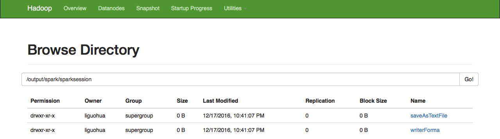
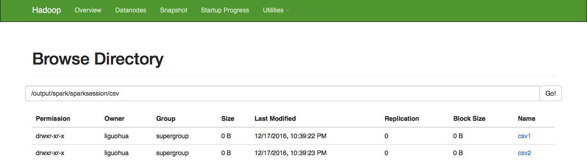
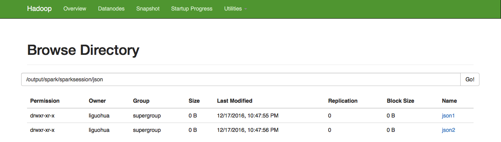
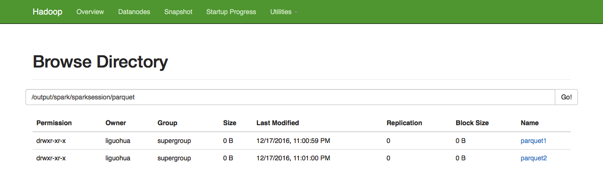
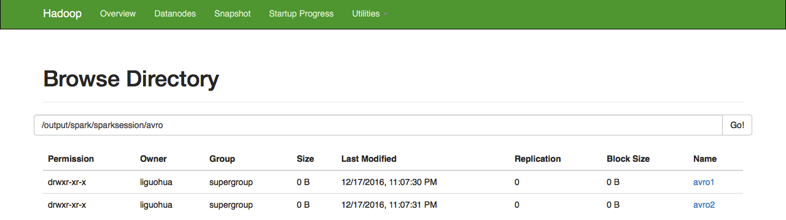

##1.SparkSession读写text文件
执行程序
```scala
package sparksql.sparksession
import book.utils.MasterUrl
import org.apache.spark.sql.SparkSession
object SparkSession006 {
  def main(args: Array[String]): Unit = {
    //0.创建SparkSession
    val spark = SparkSession.builder
      .master(MasterUrl.localAll)
      .enableHiveSupport()
      .appName(this.getClass.getName)
      .getOrCreate()

    //1.第1种读取方式read.textFile
    val text1 = spark.read.textFile("hdfs://qingcheng11:9000/input/spark/README.md")
    text1.show()

    //2.第2种读取方式read.text
    val text2 = spark.read.text("hdfs://qingcheng11:9000/input/spark/README.md")
    text2.show()

    //3.第3种读取方式read.text读取多个文件
    val text3 = spark.read.text("hdfs://qingcheng11:9000/input/spark/person_libsvm.txt",
    "hdfs://qingcheng11:9000/input/spark/README.md")
    text3.show()

    //4.第4种读取方式read.用郑总表达式匹配文件
    val text4 = spark.read.text("hdfs://qingcheng11:9000/input/spark/*.csv",
    "hdfs://qingcheng11:9000/input/spar*/*.json")
    text4.show()

    //5.第1种写出方式rdd.saveAsTextFile
    val outDir = "hdfs://qingcheng11:9000/output/spark/sparksession/"
    text1.rdd.saveAsTextFile(outDir + "saveAsTextFile")

    //6.第2种写出方式write.format("text").save()
    text1.write.format("text").save(outDir + "writerForma")
    spark.stop()
  }
}

```
执行效果
 
##2.SparkSession读写csv文件
执行程序
```
package sparksql.sparksession

import book.utils.MasterUrl
import org.apache.spark.sql.SparkSession
object SparkSession007 {
  def main(args: Array[String]): Unit = {
    //0.创建SparkSession
    val spark = SparkSession.builder
      .master(MasterUrl.localAll)
      .enableHiveSupport()
      .appName(this.getClass.getName)
      .getOrCreate()
    val m = Map("header" -> "true", "inferSchema" -> "true")
    //1.读取csv的方式一
    val csv1 = spark.read.options(m).csv("hdfs://qingcheng11:9000/input/spark/sales.csv")
    csv1.show()
    //2.读取csv的方式二
    val csv2 = spark.read.format("csv").options(m)
    .load("hdfs://qingcheng11:9000/input/spark/sales.csv")
    csv2.show()

    //写出csv文件的方式一
    val outDir = "hdfs://qingcheng11:9000/output/spark/sparksession/csv/"
    csv1.write.options(m).csv(outDir + "csv1")
    //写出csv文件的方式二
    csv2.write.format("csv").options(m).save(outDir + "csv2")
  }
}
```
执行效果
 


##3.SparkSession读写json文件
执行程序
```
package sparksql.sparksession

import book.utils.MasterUrl
import org.apache.spark.sql.SparkSession

/**
  * Created by liguohua on 17/12/2016.
  */
object SparkSession008 {
  def main(args: Array[String]): Unit = {
    //0.创建SparkSession
    val spark = SparkSession.builder
      .master(MasterUrl.localAll)
      .enableHiveSupport()
      .appName(this.getClass.getName)
      .getOrCreate()
    
    val jsonFilePath = "hdfs://qingcheng11:9000/input/spark/teacher.json"
    
    //1.读取json文件的第一种方式
    val json1 = spark.read.json(jsonFilePath)
    json1.show()

    //2.读取json文件的第二种方式
    val json2 = spark.read.format("json").load(jsonFilePath)
    json2.show()

    //3.写json文件的第一种方式
    val outDir = "hdfs://qingcheng11:9000/output/spark/sparksession/json/"
    json1.write.json(outDir+"json1")

    //4.写json文件的第二种方式
    json2.write.format("json").save(outDir+"json2")
  }
}
```
执行效果
 


##4.SparkSession读写parquet文件
执行程序
```scala
package sparksql.sparksession

import book.utils.MasterUrl
import org.apache.spark.sql.SparkSession

/**
  * Created by liguohua on 17/12/2016.
  */
object SparkSession009 {
  def main(args: Array[String]): Unit = {
    //0.创建SparkSession
    val spark = SparkSession.builder
      .master(MasterUrl.localAll)
      .enableHiveSupport()
      .appName(this.getClass.getName)
      .getOrCreate()

    val parquetFilePath = "hdfs://qingcheng11:9000/input/spark/users.parquet"
    val m = Map("mergeSchema" -> "true")
    //1.读取parquet文件的第一种方式
    val parquet1 = spark.read.options(m).parquet(parquetFilePath)
    parquet1.show()

    //2.读取parquet文件的第二种方式
    val parquet2 = spark.read.format("parquet").load(parquetFilePath)
    parquet2.show()

    val outDir = "hdfs://qingcheng11:9000/output/spark/sparksession/parquet/"
    //3.写parquet文件的第一种方式
    parquet1.write.options(m).parquet(outDir + "parquet1")

    //4.写parquet文件的第二种方式
    parquet2.write.format("parquet").save(outDir + "parquet2")
  }
}
```
执行效果
 


##5.SparkSession读写avro文件
添加依赖
```
1.spark原始不支持avro的读写操作
2.可以添加databricks的扩展包
3.pom.xml中添加的内容如下：

<dependency>
  <groupId>com.databricks</groupId>
  <artifactId>spark-avro_2.10</artifactId>
  <version>3.1.0</version>
</dependency>
<dependency>
  <groupId>com.databricks</groupId>
  <artifactId>spark-avro_2.11</artifactId>
  <version>3.1.0</version>
</dependency>
```

执行程序
```scala
package sparksql.sparksession

import book.utils.MasterUrl
import com.databricks.spark.avro._
import org.apache.spark.sql.SparkSession

object SparkSession0010 {
  def main(args: Array[String]): Unit = {
    //0.创建SparkSession
    val spark = SparkSession.builder
      .master(MasterUrl.localAll)
      .enableHiveSupport()
      .appName(this.getClass.getName)
      .getOrCreate()

    //1.读取avro文件的第一种方式
    val avroFilePath = "hdfs://qingcheng11:9000/input/spark/users.avro"
    val avro1 = spark.read.format("com.databricks.spark.avro").load(avroFilePath)
    avro1.show()

    //2.读取avro文件的第二种方式
    val avro2 = spark.read.avro(avroFilePath)
    avro2.show()

    val outDir = "hdfs://qingcheng11:9000/output/spark/sparksession/avro/"
    //3.写avro文件的第一种方式
    avro1.write.format("com.databricks.spark.avro").save(outDir + " avro1")

    //4.写avro文件的第二种方式
    avro2.write.avro(outDir + " avro2")
  }
}

```
执行效果
 