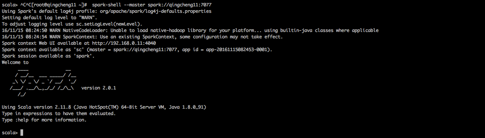
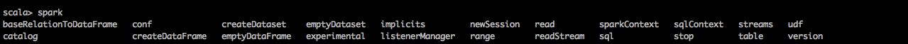

#一、SparkSession简介
```
sparkSession可以视为sqlContext和hiveContext以及StreamingContext的结合体，这些Context的API都可以通过sparkSession使用。  
Spark2.0为了平滑过渡，所以向后兼容，仍然支持hiveContext以及sqlContext。不过官方建议开发者开始使用SparkSession。
```

##1.创建SparkSession
```
要想使用sparksql首先要创建，这是进入sparksql的入口。创建方式有两种，一种是编程创建，另一种是自动创建。编程创建指的是在ide中  
编写代码自己手动创建这个实例，自动创建指的是在spark-shell环境下使用系统为我们创建好的实例。本节主要讲解在spark-shell环境下  
如何使用sparksql.

```
   
###1.1用代码创建SparkSession的实例
```
val spark = SparkSession.builder
    .master("local[2]")
    .appName("spark session example")
    .enableHiveSupport()//使用enableHiveSupport就能够支持hive，相当于hiveContext
    .getOrCreate()
```
###1.2用spark-shell创建好SparkSession  
 
```
1.打开spark-shell
spark-shell --master spark://qingcheng11:7077

2.解释
系统将为我们自动创建好了两个实例，一个是sparkcontext实例'sc'，另一个是sparksession实例'spark'.
```

##2.SparkSession对外API概览
 


#二、SparkSession常用API
##1.version
```
查看spark的版本信息
```
执行程序
```scala
spark.version
```
执行效果
```
res0: String = 2.0.1
```

##2.conf
```
获取spark的配置信息
```
执行程序
```scala
spark.conf.getAll
```
执行效果
```
res4: Map[String,String] = Map(
spark.driver.host -> 192.168.0.11, 
spark.driver.port -> 58736, 
hive.metastore.warehouse.dir -> /root/spark-warehouse, 
spark.repl.class.uri -> spark://192.168.0.11:58736/classes, 
spark.jars -> "", 
spark.repl.class.outputDir -> /tmp/spark-5dd14ab2-895c-41b8-887d-5e3254c4935a/
  repl-9493f6a2-c001-461c-b02c-3ee149da352a, 
spark.app.name -> Spark shell, 
spark.executor.id -> driver, 
spark.submit.deployMode -> client, 
spark.master -> spark://qingcheng12:7077, 
spark.home -> /bigdata/software/spark-2.0.1-bin-hadoop2.7, 
spark.sql.catalogImplementation -> hive, 
spark.app.id -> app-20161217022103-0000)
```

##1.
```
```
执行程序
```scala
```
执行效果
```
```

##1.
```
```
执行程序
```scala
```
执行效果
```
```

##1.
```
```
执行程序
```scala
```
执行效果
```
```

##1.
```
```
执行程序
```scala
```
执行效果
```
```

##1.
```
```
执行程序
```scala
```
执行效果
```
```

##1.
```
```
执行程序
```scala
```
执行效果
```
```

##1.
```
```
执行程序
```scala
```
执行效果
```
```

##1.
```
```
执行程序
```scala
```
执行效果
```
```

##1.
```
```
执行程序
```scala
```
执行效果
```
```

##1.
```
```
执行程序
```scala
```
执行效果
```
```

##1.
```
```
执行程序
```scala
```
执行效果
```
```

##1.
```
```
执行程序
```scala
```
执行效果
```
```

##1.
```
```
执行程序
```scala
```
执行效果
```
```

##1.
```
```
执行程序
```scala
```
执行效果
```
```

##1.
```
```
执行程序
```scala
```
执行效果
```
```

##1.
```
```
执行程序
```scala
```
执行效果
```
```

##1.
```
```
执行程序
```scala
```
执行效果
```
```

##1.
```
```
执行程序
```scala
```
执行效果
```
```

##1.
```
```
执行程序
```scala
```
执行效果
```
```

##1.
```
```
执行程序
```scala
```
执行效果
```
```

##1.
```
```
执行程序
```scala
```
执行效果
```
```

##1.
```
```
执行程序
```scala
```
执行效果
```
```

##1.
```
```
执行程序
```scala
```
执行效果
```
```

##1.
```
```
执行程序
```scala
```
执行效果
```
```

##1.
```
```
执行程序
```scala
```
执行效果
```
```

##1.
```
```
执行程序
```scala
```
执行效果
```
```

