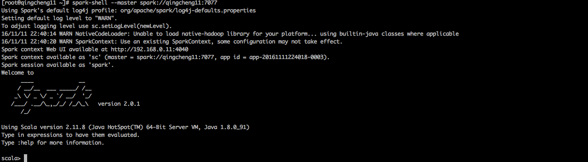
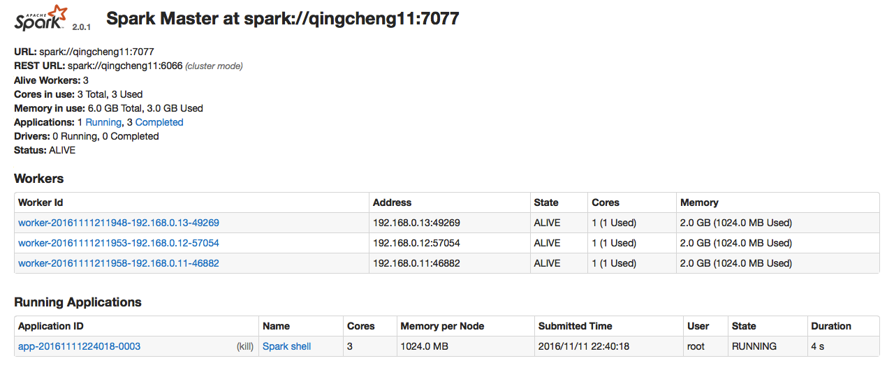
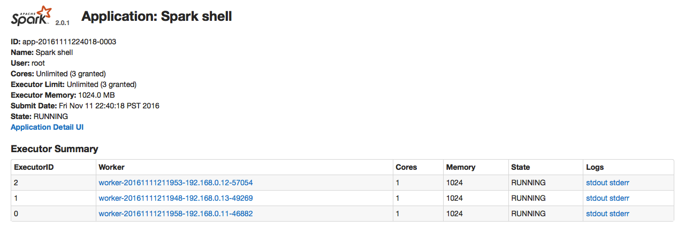
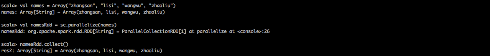
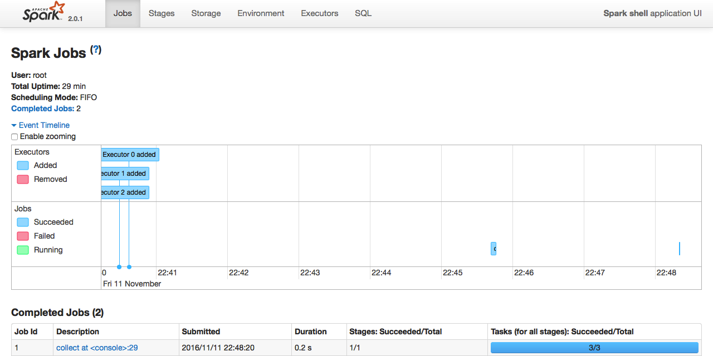
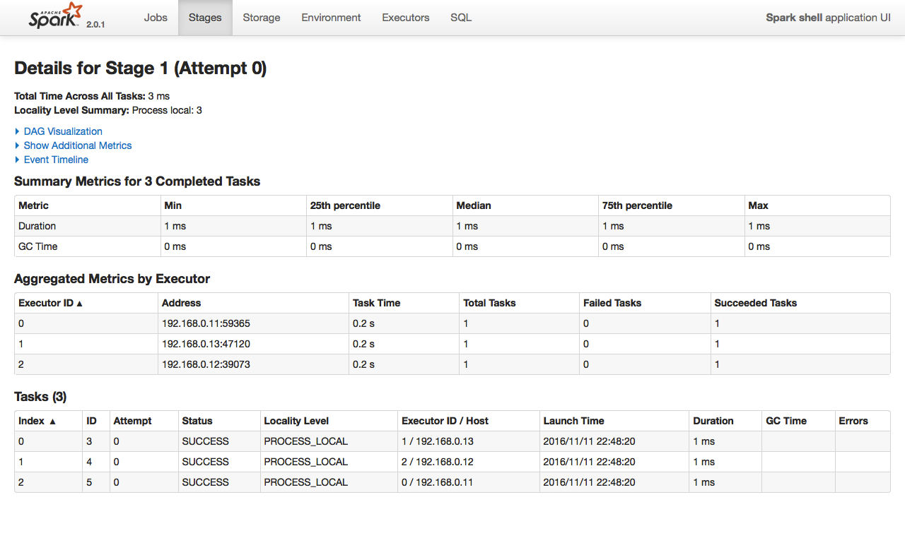
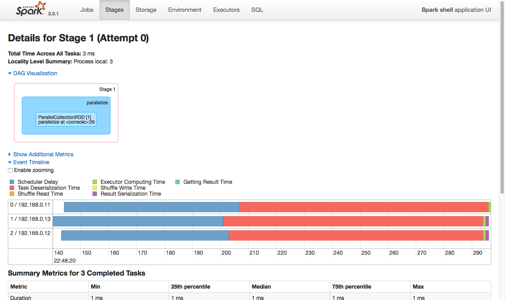
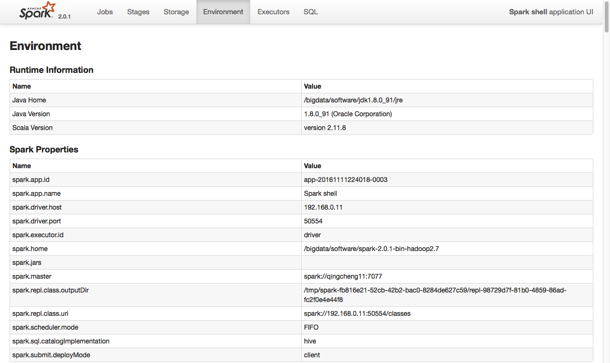
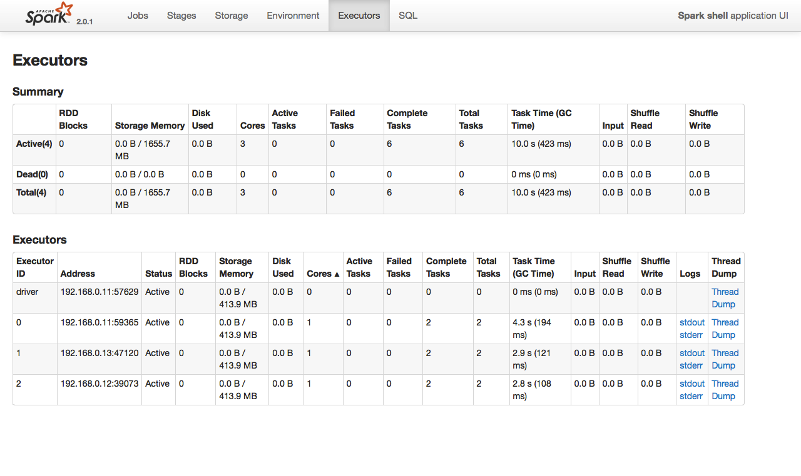

spark-shell是一个基于命令行的spark交互方式，也就是一个spark的REPL程序。
spark集群和spark-shell之间要有很多数据流和控制流的交互，spark-shell和spark集群需要时同一个网段。
1.打开spark-shell  
执行代码：
```
$SPARK_HOME/bin/spark-shell --master spark://qingcheng11:7077
```
执行效果：
 

2.验证spark-shell  
打开网址：  
```
http://qingcheng11:8080
```
执行效果：
 
可以看到application的信息，点击application，可以打开如下链接：  
 
可以进一步查看application的信息。说明spark-shell已经启动成功。  


2.运行简单的spark程序  
执行程序：  
```scala
val names = Array("zhangsan", "lisi", "wangwu", "zhaoliu")
val namesRdd = sc.parallelize(names)
namesRdd.collect()
```
执行效果：
 

解释说明：

```
1.创建一个string类型的数组，数组在本地
scala> val names = Array("zhangsan", "lisi", "wangwu", "zhaoliu")
names: Array[String] = Array(zhangsan, lisi, wangwu, zhaoliu)

2.将数组转化成rdd,RDD分布在spark集群中
scala> val namesRdd = sc.parallelize(names)
namesRdd: org.apache.spark.rdd.RDD[String] = ParallelCollectionRDD[1] at parallelize at <console>:26

3.显示RDD中的内容，将在spark集群中的RDD转化为本地数组
scala> namesRdd.collect()
res2: Array[String] = Array(zhangsan, lisi, wangwu, zhaoliu)
```

网页分析：   
跟进spark-shell，可以看到这个job运行的情况
 
跟进application的stage可以查看job运行的阶段信息
 
展开RDD信息，将可以看到更加详细的运行情况
 
跟进application的Environment可以查看job运行环境信息
 
跟进application的Executors可以查看job的Executors信息
 