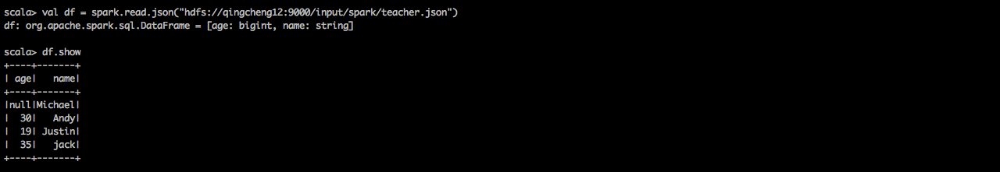
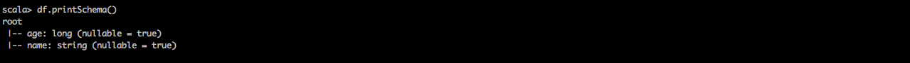
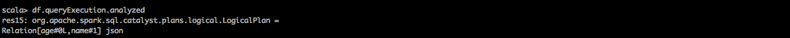

##一、SparkSession简介
sparkSession可以视为sqlContext和hiveContext以及StreamingContext的结合体，这些Context的API都可以通过sparkSession使用。  
Spark2.0为了平滑过渡，所以向后兼容，仍然支持hiveContext以及sqlContext。不过官方建议开发者开始使用SparkSession。
###1.创建SparkSession   
要想使用sparksql首先要创建，这是进入sparksql的入口。创建方式有两种，一种是编程创建，另一种是自动创建。编程创建指的是在ide中  
编写代码自己手动创建这个实例，自动创建指的是在spark-shell环境下使用系统为我们创建好的实例。本节主要讲解在spark-shell环境下  
如何使用sparksql.

####1.1用代码创建SparkSession的实例
```
val spark = SparkSession.builder
    .master("local[2]")
    .appName("spark session example")
    .getOrCreate()
```
使用enableHiveSupport就能够支持hive，相当于hiveContext
```
val spark = SparkSession.builder
    .master("local[2]")
    .appName("spark session example")
    .enableHiveSupport()
    .getOrCreate()
```
####1.2用spark-shell创建好SparkSession  
如果在spark-shell下，系统会自动创建一个SparkSession的实例，它的名字是spark。我们可以之间使用它
那我们就先在shell下使用一些这个变量吧。

######a.打开spark-shell
```
spark-shell --master spark://qingcheng11:7077
```
系统将为我们自动创建好了两个实例，一个是sparkcontext实例'sc'，另一个是sparksession实例'spark'.
 
sparksession的API操作与之前的Context基本一致
```
//读取csv数据
val df = spark.read
  .option("header","true|false")
  .csv("path to csv file")

//读取parquet数据
val df = spark.read.parquet("path to parquet file")

//读取json数据
val df = spark.read.json("path to json file")

//sql查询
val df = spark.sql("sql script")
```


######b.使用sparkSQL提供的DataFrame
0.准备数据  
在hdfs中准备一个teacher.json文件内容如下：
```
{"name":"Michael"}  
{"name":"Andy", "age":30}  
{"name":"Justin", "age":19}  
{"name":"jack", "age":35}  
```
 


1.引入隐式转化  
包含隐式转换（比如讲 RDDs 转成 DataFrames）API
```
import spark.implicits._
```
 

2.show()显示内容
```
val df = spark.read.json("hdfs://qingcheng12:9000/input/spark/teacher.json")
df.show
```
 


3.printSchema()查看schema
```
df.printSchema()
```
 


4.select()选择列
```
df.select("name").show()
```
 


5.select()选择列      
Select everybody, but increment the age by 1
```
df.select($"name", $"age" + 1).show()
```
 


6.filter()过滤行
filter people older than 21
```
df.filter($"age" > 21).show()
```
 


7.count()统计
Count people by age
```
df.groupBy("age").count().show()
```
 
 


8.queryExecution()查看整个运行计划
```
df.queryExecution
```
 


9.queryExecution.logical查看Unresolved LogicalPlan
```
df.queryExecution.logical
```
 


10.queryExecution.optimizedPlan查看optimizedPlan
```
df.queryExecution.optimizedPlan
```
 


11.queryExecution.analyzed 查看analyzed LogicalPlan
```
df.queryExecution.analyzed 
```
 


12.queryExecution.sparkPlan查看物理运行计划
```
df.queryExecution.sparkPlan  
```
 


json嵌套的例子

nest.json
```
{    
   "fullname": "Sean Kelly",       
   "org": "SK Consulting",       
   "emailaddrs": [       
      {"type": "work", "value": "kelly@seankelly.biz"},       
      {"type": "home", "pref": 1, "value": "kelly@seankelly.tv"}       
   ],       
    "telephones": [       
      {"type": "work", "pref": 1, "value": "+1 214 555 1212"},       
      {"type": "fax", "value": "+1 214 555 1213"},       
      {"type": "mobile", "value": "+1 214 555 1214"}       
   ],       
   "addresses": [       
      {"type": "work", "format": "us",       
       "value": "1234 Main StnSpringfield, TX 78080-1216"},       
      {"type": "home", "format": "us",       
       "value": "5678 Main StnSpringfield, TX 78080-1316"}       
   ],       
    "urls": [       
      {"type": "work", "value": "http://seankelly.biz/"},       
      {"type": "home", "value": "http://seankelly.tv/"}       
   ]       
}  
```
 


######b.使用sparkSQL提供的DataSet
Dataset 是一个分布式数据集合。Dataset 是自 Spark 1.6开始提供的新接口，能同时享受到RDDs的优势（强类型，  
能使用强大的lambda 函数以及SparkSQL优化过的执行引擎。Dataset 可以从 JVM 对象(s)创建  
而来并且可以使用各种 transform 操作（比如 map，flatMap，filter 等）。目前 DatasetAPI支持Scala和   
Java。Python 暂不支持 Dataset API。不过得益于 Python 的动态属性，可以享受到许多 DataSet API 的益处。
R 也是类似情况。Dataset 与 RDD 类似，但它使用一个指定的编码器进行序列化来代替 Java 自带的序列化方法或  
Kryo 序列化。尽管该编码器和标准序列化是负责将对象转换成字节，编码器是动态生成的，并提供一种格式允许 Spark  
直接执行许多操作，比如 filter、sort 和 hash 等而不用将字节数据反序列化成对象。dataset可以从rdd,dataFrame  
转化，也可以从原始数据直接生成。

1.通过toDS方法将原始数据直接生成DataSet
```
val seq=Seq("a","b")
val ds = seq.toDS()
ds.show
```
 

2.通过spark.createDataSet方法将原始数据生成DataSet
```
val seq=Seq("a","b")
val ds = spark.createDataset(seq)
ds.show
```
 


3.指定caseClass的DataSet
```
case class Person(name: String, age: Long)
val ds = Seq(Person("Jack", 32)).toDS()
ds.show()
```
 


val df = spark.read.json("hdfs://qingcheng12:9000/input/spark/nest.json")
df.createTempView("nest")
spark.sql("select * from nest")  


```
case class Person (name:String, age:Int, state:String)
var seq = Seq(Person("Michael", 29, "CA"), Person("Andy", 30, "NY"), Person("Justin", 19, "CA"), Person("Justin", 25, "CA"))
sc.parallelize(seq).toDS().createTempView("people")
val query = sql("select * from people")
```


```
case class Person (name:String, age:Int, state:String)
var seq = Seq(Person("Michael", 29, "CA"), Person("Andy", 30, "NY"), Person("Justin", 19, "CA"), Person("Justin", 25, "CA"))
sc.parallelize(seq).toDS().createTempView("people")
val query = sql("select * from people")
```


参考链接
http://www.jianshu.com/p/fc919d464d31

