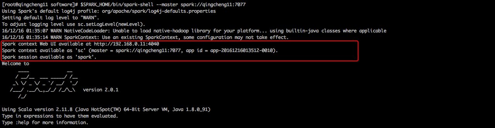
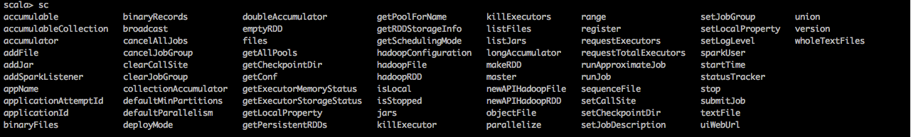

一、在spark-shell中使用SparkContext
##1.查看sparkContext
```
1.启动spark-shell查看sparkContext
$SPARK_HOME/bin/spark-shell --master spark://qingcheng11:7077
```
 

##2.sparkContext中可用方法概览
```
输入sc,并按tab键，自动提示sparkcontext下的可用方法
```
 
二、SparkContext常用API实战
##1.version
```
用于显示spark的版本信息。
```
执行命令
```
sc.version
```
执行效果
```
res1: String = 2.0.1
```
##2.getConf
```
用于获取spark的配置信息。
```
执行命令
```
sc.getConf
```
执行效果
```
res2: org.apache.spark.SparkConf = org.apache.spark.SparkConf@4d9cf71d
```

##3.getExecutorMemoryStatus
```
获取executor上的内存使用情况。
```
执行命令
```
sc.getExecutorMemoryStatus
```
执行效果
```
res3: scala.collection.Map[String,(Long, Long)] =Map(
192.168.0.12:44073 -> (434031820,434031820),
192.168.0.11:49206 -> (434031820,434031820),
192.168.0.11:57599 -> (434031820,434031820), 
192.168.0.13:49891 -> (434031820,434031820))
```

##4.master
```
获取当前master信息。
```
执行命令
```
sc.master
```
执行效果
```
res4: String = spark://qingcheng11:7077
```

##5.appName
```
获取当前application名称。
```
执行命令
```
sc.appName
```
执行效果
```
res6: String = Spark shell
```

##6. deployMode
```
查看当前spark的部署模式
```
执行命令
```
 sc.deployMode
```
执行效果
```
res7: String = client
```

##7.getExecutorStorageStatus
```
获取executor上的磁盘使用情况。
```
执行命令
```
sc.getExecutorStorageStatus.collect
```
执行效果
```
res11: Array[org.apache.spark.storage.StorageStatus] = Array(
org.apache.spark.storage.StorageStatus@2e5ff1d4, 
org.apache.spark.storage.StorageStatus@1a16583d, 
org.apache.spark.storage.StorageStatus@59da4992, 
org.apache.spark.storage.StorageStatus@20425fab)
```

##8.uiWebUrl
```
获取webUI的url
```
执行命令
```
sc.uiWebUrl
```
执行效果
```
res15: Option[String] = Some(http://192.168.0.11:4040)
```


##9.getPersistentRDDs

```
获取缓存的rdd
```
执行命令
```
//1.创建rdd
val rdd1=sc.parallelize(Seq("a","b","c"))

//2.缓存rdd
rdd1.cache

//3.显示缓存的rdd
sc.getPersistentRDDs
```
执行效果
```
scala> sc.getPersistentRDDs
res24: scala.collection.Map[Int,org.apache.spark.rdd.RDD[_]] = Map(0 -> ParallelCollectionRDD[0] at parallelize at <console>:24)
```


##10.getSchedulingMode
```
获取spark的调查模式
```
执行命令
```
sc.getSchedulingMode
```
执行效果
```
res28: org.apache.spark.scheduler.SchedulingMode.SchedulingMode = FIFO
```
##11.hadoopConfiguration
```
获取Hadoop的配置文件
```
执行命令
```
sc.hadoopConfiguration
```
执行效果
```
res29: org.apache.hadoop.conf.Configuration = Configuration: 
core-default.xml, 
core-site.xml,
mapred-default.xml, 
mapred-site.xml, 
yarn-default.xml, 
yarn-site.xml
```

##12.isLocal
```
判断是否是local模式
```
执行命令
```
scala> sc.isLocal
```
执行效果
```
res33: Boolean = false
```


##13.addFile和listFiles
```
addFile：用于向sparkContext添加文件
listFiles：用于显示添加在sparkContext中的文件
```
执行命令
```
sc.addFile("hdfs://qingcheng12:9000/input/spark/README.md")
sc.files
```
执行效果
```
scala> sc .listFiles
res38: Seq[String] = ArrayBuffer(hdfs://qingcheng12:9000/input/spark/README.md)
```


##14.addFile和listFiles
```
addJar：用于向sparkContext添加jar文件
listJars：用于显示添加在sparkContext中的jar文件
```
执行命令
```
sc.addJar("$SPARK_HOME/jars/core-1.1.2.jar")
sc.listJars
```
执行效果
```
sc.listJars
res49: Seq[String] = ArrayBuffer(spark://192.168.0.11:45404/jars/core-1.1.2.jar)
```
高级用法
```
package book.sparkcontext

import org.apache.spark.{SparkConf, SparkContext, SparkFiles}

object SparkContext002 {
  def main(args: Array[String]): Unit = {
    //1.创建配置文件
    val sparkConf = new SparkConf()
    sparkConf.setAppName("isStopped和stop")
    sparkConf.setMaster("spark://qingcheng11:7077")
    //2.创建sparkContext
    val spark = new SparkContext(sparkConf)
    val path="$SPARK_HOME/README.md"
    spark.addFile(path)
    //3.获取数据rdd
    val rdd=spark.textFile(SparkFiles.get(path))
    //4.显示数据rdd中的内容
    rdd.collect().foreach(println(_))
    //5.关闭sparkcontext
    if (!spark.isStopped) {
      spark.stop()
    }
  }
}
```


##15.stop和isStopped

```
stop用于停止sparkContext
isStopped用于判断sparkContext是否被停止
```
执行命令
```
stop.stop
sc.isStopped
```
执行效果
```
res45: Boolean = false
```
高级用法
```
package book.sparkcontext
import org.apache.spark.{SparkConf, SparkContext}
object SparkContext001 {
  def main(args: Array[String]): Unit = {
    //1.创建配置文件
    val sparkConf = new SparkConf()
    sparkConf.setAppName("isStopped和stop")
    sparkConf.setMaster("spark://qingcheng11:7077")
    //2.创建sparkContext
    val spark = new SparkContext(sparkConf)
    //3.获取数据rdd
    val rdd = spark.textFile("hdfs://qingcheng12:9000/input/spark/README.md")
    //4.显示数据rdd中的内容
    rdd.collect().foreach(println(_))
    //5.关闭sparkcontext
    if (!spark.isStopped) {
      spark.stop()
    }
  }
}
```


##0.
```
```
执行命令
```
```
执行效果
```
```


##0.
```
```
执行命令
```
```
执行效果
```
```


##0.
```
```
执行命令
```
```
执行效果
```
```


##0.
```
```
执行命令
```
```
执行效果
```
```


##0.
```
```
执行命令
```
```
执行效果
```
```


##0.
```
```
执行命令
```
```
执行效果
```
```


##0.
```
```
执行命令
```
```
执行效果
```
```


##0.
```
```
执行命令
```
```
执行效果
```
```


##0.
```
```
执行命令
```
```
执行效果
```
```


##0.
```
```
执行命令
```
```
执行效果
```
```


##0.
```
```
执行命令
```
```
执行效果
```
```


##0.
```
```
执行命令
```
```
执行效果
```
```


##0.
```
```
执行命令
```
```
执行效果
```
```


##0.
```
```
执行命令
```
```
执行效果
```
```


##0.
```
```
执行命令
```
```
执行效果
```
```


##0.
```
```
执行命令
```
```
执行效果
```
```


##0. defaultMinPartitions
```
默认最小Partition的个数
```
执行命令
```
sc. defaultMinPartitions
```
执行效果
```
res40: Int = 2
```
##0.defaultParallelism
```
默认并行度
```
执行命令
```
sc.defaultParallelism
```
执行效果
```
res41: Int = 3
```
