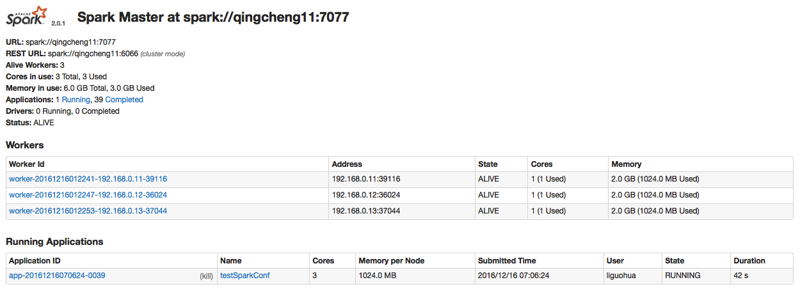

#一、在spark-shell中使用SparkConf
##1.spark在启动时输出configuration信息
```
$SPARK_HOME/bin/spark-shell \
--master spark://qingcheng11:7077 \
--conf spark.logConf=true
```

##2.SparkConf的方法概览
```
输入sc.getConf,并按tab键，自动提示SparkConf下的可用方法
```
 
#二、SparkConf常用API实战
##1.getAll
```
获取spark的所有配置
```
执行命令
```
sc.getConf.getAll
```
执行效果
```
res1: Array[(String, String)] = Array(
(hive.metastore.warehouse.dir,/root/spark-warehouse),
(spark.repl.class.uri,spark://192.168.0.11:54225/classes), 
(spark.executor.id,driver), (spark.logConf,true), 
(spark.driver.host,192.168.0.11), 
(spark.app.id,app-20161216063700-0038), 
(spark.repl.class.outputDir,/tmp/spark-b9970b93-edf9-45dc-a3ba-bc4a89fc42fd/
 repl-d7083cd8-bb45-40c3-ac63-e4f1c09921ee), 
(spark.app.name,Spark shell), 
(spark.sql.catalogImplementation,hive), 
(spark.driver.port,54225), 
(spark.home,/bigdata/software/spark-2.0.1-bin-hadoop2.7), 
(spark.jars,""), (spark.submit.deployMode,client), 
(spark.master,spark://qingcheng11:7077))
```

##2.get
```
用于获取配置中确定存在的属性
```
执行命令
```
//确定有的属性使用get获取
sc.getConf.get("spark.app.name")
```
执行效果
```
res2: String = Spark shell
```
##3.getOption
```
用于获取配置中不确定存在的属性
```
执行命令
```
//不确定有的属性使用getOption获取
sc.getConf.getOption("spark.app.name")
```
执行效果
```
res3: Option[String] = Some(Spark shell)
```

##4.getAvroSchema
```
用于获取AvroSchema信息
```
执行命令
```
sc.getConf.getAvroSchema
```
执行效果
```
res6: Map[Long,String] = Map()
```

##5.toDebugString
```
显示所有configuration的信息
```
执行命令
```
sc.getConf.toDebugString
```
执行效果
```
res9: String =
hive.metastore.warehouse.dir=/root/spark-warehouse
spark.app.id=app-20161216063700-0038
spark.app.name=Spark shell
spark.driver.host=192.168.0.11
spark.driver.port=54225
spark.executor.id=driver
spark.home=/bigdata/software/spark-2.0.1-bin-hadoop2.7
spark.jars=
spark.logConf=true
spark.master=spark://qingcheng11:7077
spark.repl.class.outputDir=/tmp/spark-b9970b93-edf9-45dc-a3ba-bc4a89fc42fd/
  repl-d7083cd8-bb45-40c3-ac63-e4f1c09921ee
spark.repl.class.uri=spark://192.168.0.11:54225/classes
spark.sql.catalogImplementation=hive
spark.submit.deployMode=client
```

##6.contains
```
判断是否包含某项配置。
```
执行命令
```
sc.getConf.contains("spark.app.id")
```
执行效果
```
res11: Boolean = true
```

##7.set
```
SparkConf中的方法大多是成对出现的，一般get和set对应。
利用get方法获取配置项，利用set方法设置配置项。
```
执行命令
```
sc.getConf.set("spark.logConf","false")
```


#二、在程序中使用SparkConf
##1.SparkConf的简单使用
执行程序
```
package book.sparkconfig
import org.apache.spark.{SparkConf, SparkContext}
object SparkConfig001 {
  def main(args: Array[String]): Unit = {
    //1.创建配置文件
    val sparkConf = new SparkConf()
    sparkConf.setAppName("testSparkConf")
    sparkConf.set("spark.logConf","true")
    sparkConf.setMaster("spark://qingcheng11:7077")
    //2.创建sparkContext
    val spark = new SparkContext(sparkConf)
    //3.获取数据rdd
    val rdd = spark.textFile("hdfs://qingcheng12:9000/input/spark/README.md")
    //4.显示数据rdd中的内容
    rdd.collect().foreach(println(_))
    //5.关闭sparkcontext
    if (!spark.isStopped) {
      spark.stop()
    }
  }
}
```
执行效果
 


##2.在spark注册Kryo类
```
spark支持自定义高性能的序列化类，
默认使用org.apache.spark.serializer.JavaSerialization，通用但性能低
可以配置为org.apache.spark.serializer.KryoSerialization，性能较好
```
执行程序
```
package book.sparkconfig

import org.apache.spark.{SparkConf, SparkContext}

object SparkConfig002 {
  def main(args: Array[String]): Unit = {
    case class Student(name: String, age: Int)
    case class Teacher(name: String, age: Int)

    //1.创建配置文件
    val sparkConf = new SparkConf()
    sparkConf.setAppName(this.getClass.getName)
    sparkConf.set("spark.logConf", "true")
    sparkConf.setMaster("local[*]")
    //2.注册serializer，默认为org.apache.spark.serializer.JavaSerialization，通用但性能低
    sparkConf.set("spark.serializer", "org.apache.spark.serializer.KryoSerialization")
    //3.配置KryoClasses类
    sparkConf registerKryoClasses (Array(classOf[Student], classOf[Teacher]))
    //4.创建sparkContext
    val spark = new SparkContext(sparkConf)
    //5.定义RDD[Student]
    val stu = spark.parallelize(Seq(Student("zhangsan", 15), Student("lisi", 16)))
    stu.foreach(println(_))
    //5.定义RDD[Teacher]
    val tea = spark.parallelize(Seq(Teacher("dahua", 55), Teacher("daming", 46)))
    tea.foreach(println(_))
    //6.关闭sparkcontext
    if (!spark.isStopped) {
      spark.stop()
    }
  }
}
```


##0.
```
```
执行命令
```
```
执行效果
```
```


##0.
```
```
执行命令
```
```
执行效果
```
```


##0.
```
```
执行命令
```
```
执行效果
```
```


##0.
```
```
执行命令
```
```
执行效果
```
```


##0.
```
```
执行命令
```
```
执行效果
```
```


##0.
```
```
执行命令
```
```
执行效果
```
```


##0.
```
```
执行命令
```
```
执行效果
```
```


##0.
```
```
执行命令
```
```
执行效果
```
```


##0.
```
```
执行命令
```
```
执行效果
```
```


##0.
```
```
执行命令
```
```
执行效果
```
```


##0.
```
```
执行命令
```
```
执行效果
```
```


##0.
```
```
执行命令
```
```
执行效果
```
```


##0.
```
```
执行命令
```
```
执行效果
```
```


##0.
```
```
执行命令
```
```
执行效果
```
```

