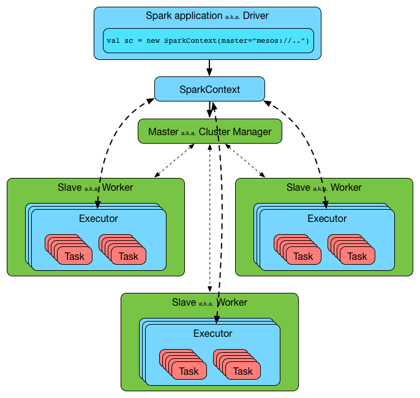

##二、spark的特性
###1.执行速度快
 
```
1.spark是基于内存的分布式计算框架，它比基于磁盘的MapReduce快的多。
2.spark在job执行时会根据任务关系的DAG图进行计算优化。
```
###2.软件栈丰富
 
```
1.spark的软件栈比较丰富，这些软件栈能够处理大量的业务场景。
2.spark支持批处理，流处理，sql,图计算，机器学习等。
```

###3.spark架构图
 
```
1.主节点master负责分发任务，并监控从节点上的任务执行情况。
2.从节点worker的负责执行任务，并报任务进度给主节点。
```

###4.spark内部工作原理
 
```
1.spark集群可以包含多个executor.
2.每个executor中可以并行执行多个task
```
###5.RDD的概念
 
```
1.spark中的基本概念是Resilient Distributed Dataset (RDD)
2.rdd中的数据被分散到集群的各个机器上以便进行并行运算。
```
###6.RDD的特性
|特性|含义|
|---|---|
|In-Memory|rdd主要是以内存为中心的，stored in memory as much (size) and long (time) as possible.|
|Immutable(Read-Only)|rdd是只读的，不会改变内容的。如果对rdd执行transform，将产生新的rdd|
|Lazy evaluated|rdd是懒计算的，所有对rdd的transform操作都是标记性的，不立即计算。等有action的时候，一起触发计算。|
|Partitioned|rdd是有分区的，这些分区分散到集群的各个node上|
|Parallel|rdd能够被并行处理的，因为它的分区被分散到各个node上，每一个分区都可以单独进行计算|


##三、参考链接
```
http://blog.csdn.net/shifenglov/article/details/43795597
http://blog.csdn.net/qq_19341327/article/details/50815356
https://segmentfault.com/a/1190000005034280
http://spark.apache.org/docs/latest/mllib-collaborative-filtering.html
https://www.zhihu.com/question/31509438
http://blog.csdn.net/oopsoom/article/details/34462329
http://www.cnblogs.com/luchen927/archive/2012/02/01/2325360.html
https://github.com/jaceklaskowski/mastering-apache-spark-book/blob/master/spark-rdd.adoc
```

